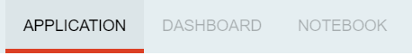
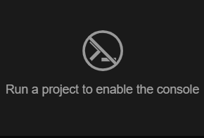
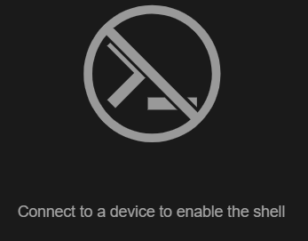
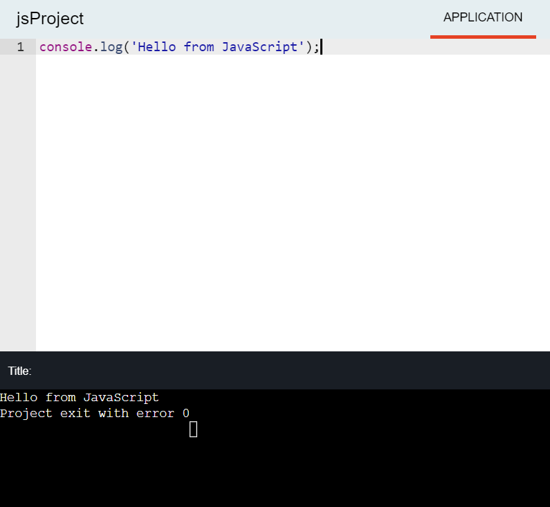
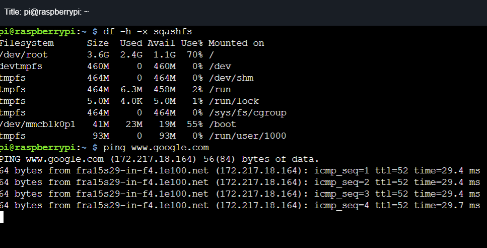

:orphan:

Wyliodrin Studio API
*************************

|

Workspace plugin API
=======================

|

“Workspace” is the main plugin in our application. It exports the *"workspace”* object, containing a series of functions that we use in every other plugin.

|

Data Types
""""""""""

|

.. autoclass:: Device

.. autofunction:: disposable

|

=========

Tabs
"""""""""

|

.. autofunction:: registerTab

In this example, the Notebook tab will be enabled and will allow user access only after 8AM. Until then, it will appear in the list of tabs as it follows:

|

.. autofunction:: registerMenuItem

In this example, the *Wyliodrin API* menu element will open a new documentation window when clicked.

|

.. autofunction:: renameMenuItem

|

.. _registerDeviceToolButton:

.. autofunction:: registerDeviceToolButton

This example creates a characteristic device button called 'Run', that will display a notification when clicked. Because of the *visible* option, the button will appear in the list of all tool buttons only after 8AM.

|

===========

Status Bar
""""""""""

|

.. autofunction:: registerStatusButton

In this example, a new status button is created. The *Console* component has to be previously created as a Vue component and imported in the *index.js* file where the new status button is registered:

.. code-block:: javascript

	import Console from './views/Console.vue';

|

.. autofunction:: openStatusButton

|

.. autofunction:: closeStatusButton

|

===========

Data Store
""""""""""

|

.. autofunction:: registerStore

|

.. autofunction:: getFromStore

|

.. autofunction:: dispatchToStore

|

==========

Vue
"""""""

|

.. autofunction:: registerComponent

|

.. autofunction:: setWorkspaceTitle

|

=================

Device Drivers
""""""""""""""

|

.. _registerDevice:

.. autofunction:: registerDeviceDriver

|

.. _updateDevices:

.. autofunction:: updateDevices

|

.. autofunction:: connect

|

.. autofunction:: getDevice

|

.. autofunction:: getStatus

|

.. autofunction:: disconnect

|

.. _showConnectionSelectionDialog:

.. autofunction:: showConnectionSelectionDialog

|

=============================

|

Projects plugin API
====================

|

The **"projects"** plugin is the second most important component in our application. Same as *"workspace"*, it has its own store, where we register the applications the user creates, in order to manage properly his activity.

|

===========

|

Data Types
""""""""""

|

.. autoclass:: Project

.. autoclass:: Language

.. autoclass:: file

.. autofunction:: disposable

======================

|

Programming Languages
"""""""""""""""""""""""
|

.. autofunction:: getLanguage

|

.. _registerLanguage:

.. autofunction:: registerLanguage

In this example, the las parameter, *python* is an object previously created, its properties being the characteristic functions for this programming language.

|

.. _registerLanguageAddon:

.. autofunction:: registerLanguageAddon

|

.. autofunction:: registerEditor

This is an example of how you can register an Ace editor that will accept python(*py*) and javascript(*js*) programming languages. The *Ace* component will be designed as a Vue component for the editor and imported inside the main file where the new editor is registered.

|

.. autofunction:: languageSpecificOption

===========

Projects
""""""""

|

.. autofunction:: createEmptyProject

|

.. autofunction:: deleteProject

|

.. autofunction:: renameProject

|

.. autofunction:: cloneProject

|

.. autofunction:: importProject

|

.. autofunction:: recursiveCreating

|

.. autofunction:: exportProject

|

.. autofunction:: recursiveGeneration

|

.. autofunction:: loadProjects

|

.. autofunction:: selectCurrentProject

|

.. autofunction:: loadPreviousSelectedCurrentProject

|

.. autofunction:: generateStructure

|

.. autofunction:: getCurrentProject

|

====================

Files and Folders
""""""""""""""""""

|

.. autofunction:: newFile

|

.. autofunction:: deleteFile

|

.. autofunction:: saveFile

|

.. autofunction:: loadFile

|

.. autofunction:: changeFile

|

.. autofunction:: saveSpecialFile

|

.. autofunction:: loadSpecialFile

|

.. autofunction:: getDefaultFileName

|

.. autofunction:: getDefaultRunFileName

|

.. autofunction:: getMakefile

|

.. autofunction:: getFileCode

|

.. autofunction:: getCurrentFileCode

|

.. autofunction:: newFolder

|

.. autofunction:: deleteFolder

|

.. autofunction:: renameObject

|

=======================

|

Dashboard Graphs Plugins
==========================

The purpose of the dashboard plugins is to create a collection of graphs that update their values according to the signals received from a connected device. 

The main plugin, *"dashboard"*, designs the Dashboard tab, which contains the list with the graphs that the user can draw, but it also serves as a store, where the states and values of the graphs are managed.

.. _registerGraph:

Inside the *index.js* file, we created the **registerGraph** function, that registers a graph component, with its data, options and settings, and constantly updates the *graphs* array in the *dashboard store*. The parameters of this function are:

.. list-table::
	:widths: 30 70

	* - Parameter title
	  - Description
	* - *name*
	  - graph label, translatable string
	* - *priority*
	  - graph priority in the list of all graphs, lower means higher in the list of all graphs
	* - *iconURL*
	  - the relative path to the image representing the graph
	* - *component*
	  - the Vue component to display when the user chooses to draw a graph
	* - *options*
	  - additional options

Also here we create the functions **registerForSignal** and **emitSignal**, that will be used by the graphs and the connected device.

Here's a list of the graphs that are currently available in the application: *Gauge*, *Line*, *Speedometer*, *Thermometer*, *Vumeter*, *Switch*, *Slider*, *Extra*.

Each dashboard graph represents a new plugin, named *"dashboard.graph.name"*, where *name* represents the actual name of the graph.

The **views** folder contains 2 Vue components:

- *NameDialog.vue*, where we design the dialog opened when the user clicks on one graph from the list, allowing to customize the options and settings 

- *NameGraph.vue*, where we use the **vue2-highcharts** module to draw a graph, according to the data entered by the user in the dialog; more details about the available Highcharts and the parameters required for each chart can be found `here <https://www.highcharts.com/>`_.

The **index.js** file of each graph has the purpose to call the :ref:`registerGraph <registerGraph>` function from the main plugin dashboard, where the *component* parameter is the *NameGraph* Vue component, and the *options* parameter is represented by on object where we define the *setup* property. Here, we call a function that opens the *NameDialog* component and updates each graph's setup options according to the data inputted by the user.

Of course, in the **package.json** file we have to specify that each dashboard.graph plugin consumes the main *dashboard* plugin.

|

=====================

|

Pin Layout plugin
=======================

|

The **Pin Layout** tab becomes visible for a user only when a board is connected to Wyliodrin STUDIO, and it loads a "map" of the board and a legend of its pins. As we described in the :ref:`wyappBoard` section, when we register this type of device, we call the *registerPinLayout* function. 

.. autofunction:: registerPinLayout

For example, if you want to register a Raspberry Pi board, inside the corresponding plugin you will call this function:

.. code-block:: javascript

	studio.pin_layout.registerPinLayout ('wyapp', 'raspberrypi', 'plugins/device.wyapp.raspberrypi/data/img/pins-raspberrypi.png');

In this situation, the program will search for a device that has the *'wyapp'* type, and the name of the corresponding board '*raspberrypi'*. 

However, you can register a pin layout only for a device type, and the selected image will be available for every device that has that type, no matter the name of the board:

.. code-block:: javascript

	studio.pin_layout.registerPinLayout ('wyapp', '', 'plugins/device.wyapp.raspberrypi/data/img/pins-raspberrypi.png');

|

Once a Raspberry Pi board is connected to Wyliodrin STUDIO, the Pin Layout tab will become available, and its content will be:

.. image:: images/pinlayout.png

The Vue component of this plugin, *PinLayout.vue*, is designed to change the pin layout image dynamically, according to the device type and board, and to become enabled/disabled, depending on the status of the device (CONNECTED / DISCONNECTED).

|

==========================

|

Console and Shell plugins
=============================

Both the Console and the Shell plugins depend on the *xterm* plugin. 

The "xterm" plugin uses the **xterm** module in order to register a terminal that will allow the user to interact with a connected board. 

The terminal has 2 implemented buttons: 

- *clear*: clear the content of the terminal
- *reset*: reboot the terminal

Both functions belong to the **xterm Terminal**, that is initialized when a device is connected. If there is no connected device, the terminal won't allow the user access and a replacement text will be displayed.

|

The Xterm Terminal functioning is based on events.

The **title** of the terminal is applied when a device is connected and it changes dynamically, according to the type of the board. For example, if a Raspberry Pi board is connected, the title will be detected and automatically set to the terminal as *pi@raspberrypi*.

|

When the user starts typing commands in the terminal, the **write** function is called in order to save all the inputted data into a buffer, unique for each terminal. We also retain the cursor position, to write the characters successively.

|

Another event is to **resize** the terminal and it has to be done at each update. The resizing action supposes to set the geometry of the terminal (number of columns and rows).

|

Both *console* and *shell* plugins have the functionalities of the described Terminal, so they have to consume the *xterm* plugin. However, there is a certain difference between the 2 components:

The purpose of the **Console** is to display a terminal that allows you to see the output of the projects that you run in the Application tab.

|

The **Shell** terminal represents the main component of the *Shell* tab, that allows you to send command directly to the board.

|

====================

|

Settings Plugin
===================

The *"settings"* plugin consumes our *filesystem* plugin in order to save special files that contain various settings for our plugins. The filesystem is implemented differently for each version of the Wyliodrin STUDIO application, but the main idea is to manage all the files and folders used inside the program.

In order to obtain the data that was written into a special settings file, we need to read the content of this file located inside a special settings folder. 

|

The main functions of the settings plugin are:

.. autofunction:: storeSettings

|

.. autofunction:: loadSettings

|

.. autofunction:: loadValue

|

.. autofunction:: storeValue

|

.. Protocol
.. ===========

.. The interaction between a device connected to Wyliodrin STUDIO and the user who wants to transmit and receive data to and from it is possible as long as a well defined protocol is established.

.. The transferred packets are required to include:

.. * t - tag, to know which component of the program serves as "bridge" between the user and the device
.. * d - data, object with the tags of the actions and options

.. Shell
.. """""""

.. **Open**

.. Send to device:

.. * t:'s'
.. * d: {a:'o', c:columns, r:rows}

.. .. list-table

.. 	* - Label
.. 	  - Description
.. 	* - 's'
.. 	  - the shell tag
.. 	* - a
.. 	  - tag for the action to be performed
.. 	* - 'o'
.. 	  - open the shell action tag
.. 	* - c
.. 	  - terminal columns number tag
.. 	* - r
.. 	  - terminal rows number tag

.. |

.. Receive from the device

.. * t:'s'
.. * d: {a:'o', r:'d'}

.. |

.. * t:'s'
.. * d: {a:'o', r:'e', e:error}

.. .. list-table

.. 	* - Label
.. 	  - Description
.. 	* - 's'
.. 	  - the shell tag
.. 	* - a
.. 	  - tag for the action to be performed
.. 	* - 'o'
.. 	  - open the shell action tag
.. 	* - r
.. 	  - tag for the response received from the device
.. 	* - 'd'
.. 	  - 
.. 	* - 'e'
.. 	  - error occured tag
.. 	* - e
.. 	  - the actual error tag

.. |

.. **Keys**

.. Send to device:

.. * t:'s'
.. * d:{a:'k', t:keys}

.. list-table

.. 	* - Label
.. 	  - Description
.. 	* - 's'
.. 	  - the shell tag
.. 	* - a
.. 	  - tag for the action to be performed
.. 	* - 'k'
.. 	  - tag for key written in the terminal
.. 	* - t
.. 	  - 
.. 	* - keys
.. 	  - 

.. |

.. Receive from the device:

.. * t:'s'
.. * d:{a:'k', t:keys}

.. |

.. * t:'s'
.. * d:{a:'e', e:error}

.. .. list-table::

.. 	* - Label
.. 	  - Description
.. 	* - 's'
.. 	  - the shell tag
.. 	* - a
.. 	  - tag for the action to be performed
.. 	* - 'e'
.. 	  - error tag
.. 	* - t
.. 	  - 
.. 	* - keys
.. 	  - 
.. 	* - 'e'
.. 	  - error occured tag
.. 	* - e
.. 	  - the actual error tag

.. |

.. **Resize**

.. Send to device:

.. * t:'s'
.. * d:{a:'r', c:columns, r:rows}

.. .. list-table

.. 	* - Label
.. 	  - Description
.. 	* - 's'
.. 	  - the shell tag
.. 	* - 'r'
.. 	  - resize the shell tag
.. 	* - c
.. 	  - terminal columns number tag
.. 	* - r
.. 	  - terminal rows number tag

.. |

.. **Stop**

.. Send to device:

.. * t:'s'
.. * d:{a:'s'}

.. .. list-table

.. 	* - Label
.. 	  - Description
.. 	* - 's'
.. 	  - the shell tag
.. 	* - 's'
.. 	  - stop the shell tag

.. |

.. Receive from the device

.. * t:'s'
.. * d:{a:'s', r:'d'}

.. |

.. * t:'s'
.. * d:{a:'s', r:'e', e:error}

.. .. list-table

.. 	* - Label
.. 	  - Description
.. 	* - 's'
.. 	  - the shell tag
.. 	* - 's'
.. 	  - stop the shell tag
.. 	* - r
.. 	  - tag for the device response
.. 	* - 'd'
.. 	  - 
.. 	* - 'e'
.. 	  - error response tag
.. 	* - e
.. 	  - the actual error tag

.. |

.. Project
.. """"""""

.. **Run**

