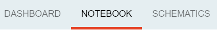
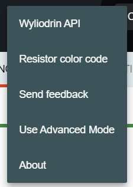
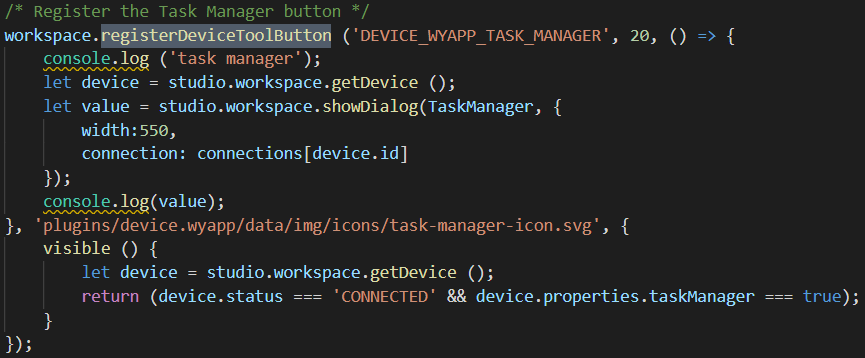
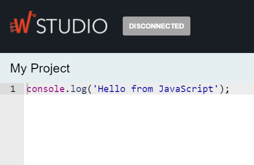
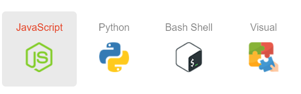
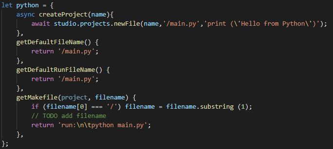

:orphan:

.. _api:

Wyliodrin Studio API
=======================

|
|

**Workspace plugin**
***********************

registerTab
""""""""""""
Registers an item that may be disposed in the application.

The function parameters are:

* *"name"* = element label, registered as a string that will be translated
* *"priority"* = element priority in the list with all menu items: the tab with the lowest priority will be displayed to the left
* *"component"* = the vue component attached to the current tab
* *"options"* = additional options: **visible**, or **enabled**

At first, we check if the *name* of the tab can be found in our global **tabs** array and if the result is null, we create a new object using the parameters as properties. After pushing the newly created tab into the array, we sort them by priority and dispatch the array to the workspace store.

For example, in order to register the ‘Notebook’ tab, in the index.js file corresponding to the notebook plugin, we called the function:

.. code-block:: javascript

	registerTab('PROJECT_NOTEBOOK', 300, Notebook)

registerComponent
""""""""""""""""""

* *"component"* = the vue component we created as a *"MyVueFile.vue"*

Registers a new vue-component. As an example, we used it to register our Xterm component, in the *"xterm"* plugin:

.. code-block:: javascript

	registerComponent (Notebook);

registerMenuItem
"""""""""""""""""""
Registers an element in the app’s menu.

The function parameters are:

* *"name"* = element label, registered as a string that will be translated
* *"priority"* = element priority in the list with all menu items; same convention applied as for **registerTab** function
* *"component"* = the vue component attached to the current item
* *"options"* = additional options: **visible**, or **enabled**

At first, we check if the *name* of the menu item can be found in our global **menuItems** array and if the result is null, we create a new object using the parameters as properties. After pushing the newly created menu item into the array, we sort them by priority and dispatch the array to the workspace store.

For example, we registered the item *“Wyliodrin API”* in the *"documentation"* plugin (index.js file)

.. code-block:: javascript

	registerMenuItem ('WYLIODRIN_API', 10, () => documentation.openDocumentation());

where the component corresponds to a predefined function, that opens the actual documentation

registerToolbarButton
"""""""""""""""""""""""
Registers a new button in the app’s toolbar.

The function parameters are:

* *"name"* = element label, registered as a string that will be translated
* *"priority"* = element priority in the list with all toolbar buttons same convention applied as for **registerTab** function
* *"action"* = the actions that the buttton will perform on click
* *"iconURL"* = the image assigned
* *"options"* = additional options: **visible**, or **enabled**

At first, we check if the *name* of the toolbar button can be found in our global **toolbarButtons** array and if the result is null, we create a new object using the parameters as properties. After pushing the newly created toolbarButton into the array, we sort them by priority and dispatch the array to the workspace store.

For example, we register a button having the translation key 'TOOLBAR_BUTTON', the priority 10, that on click will pop up a notification with the "You created a toolbar button" text. We need to specify the relative path to the image related to the button.

.. code-block:: javascript

	registerToolbarButton('TOOLBAR_BUTTON', 10, () => showNotification('You created a toolbar button', 'plugins/projects/data/img/icons/button.svg');

.. image:: images/registerToolbarButton.png
	:align: center

.. _registerDeviceToolButton:

registerDeviceToolButton
"""""""""""""""""""""""""""

Registers a new button used to manage the functioning of a device. These buttons show up only when a device is connected and they are specific for every device.

The function parameters are:

* *"deviceType"* = the type of the device for which we want to create the button
* *"priority"* = element priority in the list with all device buttons; same convention applied as for **registerTab** function
* *"action"* = the actions that the buttton will perform on click
* *"iconURL"* = the image assigned
* *"options"* = additional options: **visible**, or **enabled**

At first, we check if the *name* of the device button can be found in our global **deviceToolButtons** array and if the result is null, we create a new object using the parameters as properties. After pushing the newly created deviceToolButton into the array, we sort them by priority and dispatch the array to the workspace store.

For example, when a raspberry pi is connected, we have the following buttons: **Run**, **Stop**, **TaskManager**, **PackageManager**, **NetworkManager**, which we registered in the *“device.wyapp”* plugin.

.. !!imagine butoane cu pi conectat

An example on how to use thihs function can be:

.. code-block:: javascript

	registerDeviceToolBotton('RUN', 10,  => showNotification('You clicked the Run button!', 'plugins/workspace/data/img/icons/button.svg')

registerStatusButton 
""""""""""""""""""""""
Registers the buttons used to open the *console* or the *mqtt* server.

The function parameters are:

* *"name"* = element label, registered as a string that will be translated
* *"priority"* = element priority in the list with all status buttons; same convention applied as for **registerTab** function
* *"component"* = the vue component attached to the current item
* *"iconURL"* = the image assigned
* *"options"* = additional options: **visible**, or **enabled**

At first, we check if the *name* of the status button can be found in our global **statusButtons** array and if the result is null, we create a new object using the parameters as properties. After pushing the newly created statusButton into the array, we sort them by priority and dispatch the array to the workspace store.

.. code-block:: javascript

	registerStatusButton('CONSOLE', 1, Console, 'plugins/console/data/img/icons/terminal-icon.svg');

.. image:: images/registerStatusButton.png
	:align: center
	:width: 80px
	:height: 50px

registerStore
""""""""""""""""
Registers the Vuex store for a plugin.

A *"store"* is basically a container that holds your application state. There are two things that make a Vuex store different from a plain global object: Vuex stores are reactive. When Vue components retrieve state from it, they will reactively and efficiently update if the store's state changes.

The function parameters are:

* *"namespace"* = the name given to the store
* *"store"* = the actual store object, imported from the *'./store'* file of the plugin

For example, to register the store for the *“projects”* plugin, we had to call this function:

.. code-block:: javascript

	registerStore('projects', projectStore);

where project store had to be imported:

.. code-block:: javascript

	import projectStore from './store';

getFromStore
"""""""""""""""
Gets the value of a variable from a certain store.

The function parameters are: 

* *"variable"* = the name of the variable that we want to process
* *"namespace"* = the name of the store where the variable is registered

We called this function to get the current project from our *“projects”* store:

.. code-block:: javascript

	let project = getFromStore('projects', 'currentProject');

dispatchToStore
"""""""""""""""""""
Sends data to the store promptly. 

The function parameters are:

* *"namespace"* = the name of the store where you want to dispatch
* *"action"* = the variable that you want to update
* *"data"* = the additional data that you want to send to the variable

Similar as before, we used it in the *"projects"* plugin, to register the current project into the store:

.. code-block:: javascript

	dispatchToStore('projects', 'currentProject', null);

setWorkspaceTitle
""""""""""""""""""""

The only parameter of this function is: 

* *"title"* = the title of the current project

Loads the title of the current project from the store and displays it as the workspace **title**. 

This action is done in the *“projects”* plugin.

.. code-block:: javascript

	setWorkspaceTitle (project.name);

For example, if we create and select a new project, named **“My Project”**, the workspace title will look like: 

registerDeviceDriver
"""""""""""""""""""""""""""""""

The function parameters are:

* *"name"* = name of the new device type
* *"deviceDriver"* = object created in the "setup" function of a "device" plugin, which consists of a series of functions necessary for a device: **defaultIcon**, **connect**, **settings**, **disconnect**.

The function registers a new device type. If the name of the new device type can’t be found in the list with all device drivers, then the actual **“deviceDriver”** will be registered.

We are using this function in the *“device.wyapp”* and *“device.rpk”* plugins to list a network, respectively a RPK device. Our **deviceDriver** is an object with its own specifications.

.. code-block:: javascript

	workspace = registerDeviceDriver('wyapp', deviceDriver);

First of all, a default image is set to this object so that it become easy for the user to connect to his favorite device.

Then, we create the “connect” function, that sets up the transport (address, port), the connection and the device status. 

The next step is to update the device settings and after that to create the “disconnect” function.

We also use a *getConnections* and *registerForUpdate* functions.

Once the **deviceDriver**  registered, if it can be connected, we register its specific buttons, using the **registerDeviceToolButton** function. 

updateDevices
"""""""""""""""""
This function searches for new devices and update the **availableDevices** list.

The parameters are:

* *"type"* = the type of the device, it has to be previously registered using the *registerDeviceDriver* function
* *"dev"* = the array of devices that will be updated

We are using it in our *"device.wyapp"* plugins, each time we are searching for new devices.

For example, in *“device.wyapp.ssh”* plugin:

.. code-block:: javascript

	deviceDriver.updateDevices (sshDevices);

connect
"""""""""
This function is obviously used to connect to a device.

The function parameters are: 

* *"device"* = the device object that we want to connect
* *"options"* = additional options 

The first step is to chech if the device we are trying to connect really is an actual device type. If it can be found in our **deviceDrivers** list, then we trasmit its type and status to the workspace store.

getDevice()
"""""""""""""""""
Returns a device from the store. We call the **getFromStore** function, wich returns the **device** objects, with all its properties.

We are using it each time we want to work with the currently connected device and we want to know its type.

For example:

.. code-block:: javascript

	let device = getDevice ();

getStatus()
"""""""""""""""""""
Returns a device status from the store.

The device statuses are:

* *DISCONNECTED* - this is offline
* *CONNECTING* - trying to connect
* *SYNCHRONIZING* - trying to synchronize with the device
* *CONNECTED* - this is online
* *ISSUE* - there is some issue, the system is partially functional
* *ERROR* - there is an error with the system

disconnect ()
""""""""""""""""""
Disconnects from a device.

The first step is to get the current device object, using the **getDevice()** function, then to check if it's an actual device type. If positive, we can disconnect the device.

|

**Projects plugin**
**********************

getLanguage
"""""""""""""""""
Returns a programming language object with the following properties: id, title, icons, addons and options.

The only parameter of the function is:

* *"languageID"* = the unique id of a certain language

.. _registerLanguage:

registerLanguage
"""""""""""""""""""
Updates the **“languages”** array with an object referring to a programming language.
The function parameters are:

* *"id"* = the programming language unique id
* *"title"* = the name of the programming language
* *"icon"* = a representative image attached to the programming language
* *"options"* = additional specifications

The accepted languages are: *javascript*, *python*, *bash* and *visual*. 

For example, to add the python language, we had to register it in the *index.js* file of the *"language.python"* plugin:

.. code-block:: javascript

	registerLanguage('python', 'Python', 'plugins/language.python/data/img/python.png', python);

where **“python”**, the last parameter, is an object that contains the specifications of the python programming language, mentioned above.

Where the functions used as properties for the *python* object will be explained later.

registerLanguageAddon
""""""""""""""""""""""""
Applies an addon for an existing programming language. In this case, an addon refers to a specific feature that we set up for a board.

The function parameters are:

* *"language"* - language id
* *"board"* - addon board
* *"type"* - addon type
* *"options"* - addon options

.. _editor:

registerEditor
""""""""""""""""
Registers a new text editor, using the embeddable code editor Ace, in order to add a syntax highlighting textbox.

* *"name"* - the name/id of the editor
* *"language"* - the editor language
* *"component"* - the component to display
* *"options"* - the additional options **visible** and **enabled**

For example, in the *“projects.editor.ace”* we created an Ace Editor which supports some file types:

.. code-block:: javascript

	registerEditor('EDITOR_ACE',['py','js','json','d','c','h','sh'], Ace);

createEmptyProject
"""""""""""""""""""
Creates a new, empty project, having the name and language specified by the user.

The parameters are: 
* *"name"* - the name the user wants to assign to the new project
* *"language"* - the programming language selected for the project

As an example, we called this function in the *“projects”* plugin (*AddProjectDialog.vue* component):

.. code-block:: javascript

	project = createEmptyProject('New project', 'py')

where **New project** is the name of your project and **py** is the language id for python.

deleteProject
"""""""""""""""

The parameter is:

* *"project"* = name of the project the user wants to delete

This function deletes all the files related to the project chosen by the user. It is called inside the **ProjectLibrary.vue** component, when the user clicks on the "Delete" button. After removing all the files, we dispatch to the projects store the *currentProject* and the *currentFile* as *null*.

You can use the function like this:

.. code-block:: javascript

	deleteProject('New Project');

Where **New Project** is the name of the project you want to delete.

renameProject
""""""""""""""
Replaces the name of a chosen project with the **“newName”** value, that is selected in the input text area.

The function parameters are:

* *"project"* = name of the project the user wants to rename
* *"newName"* = the new name that the user wants to assign to the current project

The function is called inside the **ProjectLibrary.vue** component, when the user clicks on the *"Rename"* button.

You can use the function like this:

.. code-block:: javascript

	renameProject('New Project', 'Renamed Project');

Where **New Project** is the name of the project you want to rename and **Renamed Project** is the new name.

cloneProject
""""""""""""""
Creates a duplicate of the selected project and it names it with the **“newName”** value chosen by the user. 

The function parameters are:

* *"project"* = name of the project the user wants to rename
* *"newName"* = the name that the user wants to assign to the cloned project

Same as **renameProject**, the function is called inside the **ProjectLibrary.vue** component, when the user clicks on the *"Clone"* button.

You can use the function like this:

.. code-block:: javascript

	cloneProject('New Project', 'Cloned Project');

Where **New Project** is the name of the project you want to clone and **Cloned Project** is the name that your cloned project will have.

importProject
""""""""""""""""
Loads a new project tree from the user’s computer. Its parameters are:

* *"project"* = project object
* *"extension"* = archive extension (.zip/.tar/.wylioapp)

The archive extension can be *“.zip”*, *“.tar”* (in this case the files will be extracted), or *‘.wylioapp”* (we are creating recursively the project folder).

For example, you can use the function like this:

You can use the function like this:

.. code-block:: javascript

	importProject('New Project', '.zip');

Where **New Project** is the name of the project you want to import and **.zip** represents its extension.

recursiveCreating
""""""""""""""""""""""""""""
Generates the project tree structure with paths and names. 

The parameter:

* *“necessary”* = an object representing the details about every file within the project

	* *necesarry.item* - file item
	* *necessary.item.isdir* - is or not directory
	* *necessary.item.children* - only if it's a directory
	* *necessary.item.name* - name
	* *necessary.item.content* - file content only if it's a file

We are using it in the *importProject* function mentioned before (*.wylioapp* extension)

exportProject
"""""""""""""
The function parameters are:

* *"project"* = the current project chosen
* *"savePath"* = the destination path selected by the user

Exports a project archive (*.zip* extension format) to the chose path in user’s computer.

You can use the function like this:

.. code-block:: javascript

	exportProject('New Project', 'C:\Users\User\Desktop');

Where **New Project** is the name of the project you want to export, and the second argument represents the path where your project will be exported to.

newFolder
"""""""""""""
Creates a new folder in the current project.
The parameters of this function are:

* “project” = the current project object”
* “name” = path to where to create the new folder. 

This option is valid only in the *Advanced Mode*.

You can use the function like this:

.. code-block:: javascript

	newProject('New Project', 'C:\Users\User\Desktop');

Where **New Project** is the name of the project you want to create, and the second argument represents the path where your project will be created.

newFile
""""""""
Creates a new file in the current project.
The function parameters are:

* “project” = the current project object”,
* “name” = path to where to create the new folder
* “data” =  data that will be written in the new file

For example, when we create a new programming language, in its particular object we use the **newFile** function and create the main file of the project:

.. code-block:: javascript 

	newFile(name, '/main.js', 'console.log(\'Hello from JavaScript\');');

This option is valid only in the *Advanced Mode*.

renameObject
"""""""""""""""""""""""""""""""""""""""""""
Renames the selected file/ folder.

The function parameters are:

* “project” = the project object
* “newName” = the new name of the project, chosen by the user
* "pathTo" = path to existing file/folder

Available only for the *Advanced Mode*, this function is called when the user choses the *Rename* option in the menu that shows up by right clicking on a folder/file.

You can use the function like this:

.. code-block:: javascript

	exportProject('New Project', 'Project New Name', 'C:\Users\User\Desktop');

Where **New Project** is the name of the project you want to rename, **Project New Name** is the new name that the file/folder will have and the last argument represents the path to your project.

deleteFile
"""""""""""""""""""""""""""""""""
Deletes the current file of a project tree.

The function parameters are:

* “project” = the project object
* “pathTo” = the path to the selected file

.. code-block:: javascript

	deleteFile('New Project', 'C:\Users\User\Desktop\file');

Where **New Project** is the name of the project you want to modify and the second argument represents the path to the file you want to delete.

deleteFolder
"""""""""""""
Deletes the selected folder of a project tree.

The function parameters are:

* “project” = the project object
* “pathTo” = the path to the folder

.. code-block:: javascript

	deleteFolder('New Project', 'C:\Users\User\Desktop\folder');

Where **New Project** is the name of the project you want to modify and the second argument represents the path to the folder you want to delete.

loadProjects
"""""""""""""
Loads the existing projects.

This function has no parameter. We are using it after each change that was made on the **Projects library**: *renameProject*, *cloneProject*, *importProject*.

For example:

.. code-block:: javascript

	let projects=loadProjects();

In this case, *projects* will be an array with all the created projects.

selectCurrentProject
""""""""""""""""""""""

Selects a project when the user clicks on the image attached to it and it loads the data in the Application tab.

The only parameter is:

* *"project"* = the project where the user decides to select

loadPreviousSelectedCurrentProject
"""""""""""""""""""""""""""""""""""""
Loads the last selected project from the local files. 

The function has no parameters.

We are using this function in the **Application.vue** component pf the *"projects"* plugin, in the *created()* section, because we want to load the last selected project at each new running of the application.

saveFile
"""""""""
Saves an edited file.

The function parameters are:

* “project” = the project object
* “name” = the path to the file
* “buffer” = the file buffer that will actually be saved

You can use the function like this:

.. code-block:: javascript

	saveFile('New Project', 'File_Name', [1, 2, 3]);

Where **New Project** is the name of the project where you want to save a file, **File_Name** is the name you want to give to the saved file and the second argument represents the array that will be registered in your file.

loadFile
"""""""""""
Loads a file. It returns a string that represents the file content.

The function parameters are:

* “project” = the project object
* “name” = the full file name, including its path

An example on how to use this function is:

.. code-block:: javascript

	loadFile('New Project', 'File_Name');

Where **New Project** is the name of the project where you want to load a file from and **File_Name** is the name of the file whose content you want to load.

changeFile
"""""""""""
Changes the current file in the store.

The only parameter is:

* “name”=path to the file

saveSpecialFile
"""""""""""""""""
Saves a special settings file.

This function parameters are:

* “project” = the current project object
* “name” = the special file name
* “content” = the content that will be saved in the special file

For example:

.. code-block:: javascript

	saveSpecialFile('New Project', 'File_Name', [1, 2, 3]);

Where **New Project** is the name of the project where you want to save a file, **File_Name** is the name you want to give to the saved file and the second argument represents the array that will be registered in your file.

loadSpecialFile
""""""""""""""""
Loads a special settings file.

The parameters are:

* “project” = the current project object
* name” = the special file name

Given the example above, we call this function to load the content that was previously saved in the file

.. code-block:: javascript

	let output = loadSpecialFile('New Project', 'File_Name');

The value of the **output** variable will be the array: [1,2,3].

recursiveGeneration
""""""""""""""""""""
Recursively generates a deep object with all the contents of a project and returns an object, which is the root of the folder with all its contents.

The function parameters are:

* "project" = the selected project object
* "file" = the file object

generateStructure
""""""""""""""""""""

Generates the tree structure of a project and it returns the tree structure with items of type **recursiveGeneration** (explained above).

The parameters are:

* *"project"*  the current project object 
* *"isRoot=true"*

getCurrentProject
""""""""""""""""""
Returns a project object loaded from the store.

The function has no parameters.

For example:

.. code-block:: javascript

	let project = getCurrentProject();

The value of the **project** variable will be *'New Project'*.

getDefaultFileName
"""""""""""""""""""
Returns the default file name for a specified project.

The only parameter is:

* *"project"* = the selcted project object

For example, in the *“language.python”* plugin, we create a *“python”* object, to which we associate the default file name *‘/main.py’*.

.. code-block:: javascript

	getDefaultFileName() {
            return '/main.py';
    }

getDefaultRunFileName
""""""""""""""""""""""
Returns the default run file name for a specified project.

The only parameter is:

* *"project"* = the selcted project object

Same as the **getDefaultFileName** function above,, in the *“language.python”* plugin, inside the *“python”* object we created, we associate the default run file name *‘/main.py’*.

.. code-block:: javascript

	getDefaultRunFileName() {
        return '/main.py';
    }

getMakefile
""""""""""""""
Similar to the 2 functions above, returns the makefile for the main file of a project.

The function parameters are:

* *"project"* = the selected project object
* *"filename"* = the file name for the selected project

An example of use of this function can also be found in the *“language.python”* plugin:

.. code-block:: javascript

	getMakefile(project, filename) {
        return 'run:\n\tpython main.py';
    }

languageSpecificOption
"""""""""""""""""""""""
Gets the default run file name of a language.

The function parameters are: 

* *"project"* = the selected project object
* *"option"* = the name of the option we want to obtain

An example of use for this function could be:

.. code-block:: javascript

	let sourceLanguage = languageSpecificOption ('New Project', 'sourceLanguage');

The value of the **sourceLanguage** variable will be the default run file name, let's say *python*.

getFileCode
""""""""""""""
Gets the file code of a project.

The function parameters are:

* *"project"* = the project object
* *"pathTo"* = the path to the file

To obtain the full path of the file where the code is located, we join the project folder and the **pathTo**, then we validate this actual path. 
To obtain the file code we are interested in, we use the 
**readFile(actualPath)** function.

getCurrentFileCode
"""""""""""""""""""""""""""
Get the current file code.

The function has no parameters.

This function returns an object representing the current project with its tree structure. We use the **getFromStore** function to obtain the *currentProject* and *currentFile* and, similar to the function above, we validate the path and call  the **readFile** function.

