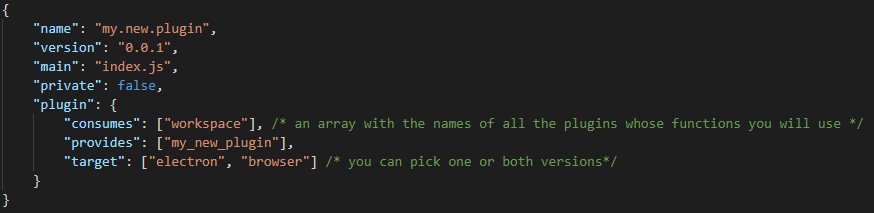
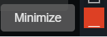

:orphan:

General Architecture of Wyliodrin STUDIO
===========================================

|

Wyliodrin STUDIO consists of a series of plugins that we used to build the different parts of our application. 

Basically, a plugin is a software component that helps you to add specific feature to a program. When a program supports plugins, it enables customization, which means that you will be able contribute to the development and improvement of our application.

To design a pleasing, yet accessible and easy to use, interface for our users, we chose the `Vue framework <https://vuejs.org/v2/guide>`_. The connection between frontend and API has become a common point of challenge and complexity. Since we are using **Vue** to develop our frontend, the best solution to this problem is the `VueX <https://vuex.vuejs.org/>`_ library, which is deeply integrated into Vue and created to take advantage of Vue's Reactivity.

|

**ADD A NEW PLUGIN**

.. _plugin:

In order to create your own plugin, you should open the folder that you cloned before with a source-code editor, like **Visual Studio Code**. After that, you will have to open the **plugins** folder, that represents the *"storage center"* for all the plugins and that is found inside the **source** folder. Here, in **plugins** you will create a new folder, named after the plugin you’d like to add. 

.. image:: images/plugins.png
	:align: center

The plugin name will be lowercase, and the words separated by “.”
For example, we’ll create the **my.new.plugin** folder.

The main components that you’ll need to create for your plugin are:

* The **views** folder: here you will design the user interface for your plugin, using the progressive framework *VUE*, so here you will be creating all your *.vue* files. (In our case, *MyVueFile.vue*)
* The **package.json** file, which contains an object with the primary details regarding your plugin:

	1. *“name”* : the name of your plugin (“my.new.plugin”)
	2. *“version”*: *“0.0.1”*
	3. *“main”*: the main file of the plugin, that we’ll call **“index.js”**
	4. *“private”*: **false**/**true**, if you want your plugin to be seen by everyone or only by yourself
	5. *“plugin”*: an object where we specify if our plugin consumes other plugins (it's using functions exported by these other plugins) and if it provides something, if necessary (our plugin will export functions to be used by other plugins). We also include here the *target* property, which specifies for each version of the program the plugin should be working: **browser** or **electron**.

	As an example, a *package.json* file should look like this:

* The **index.js** file, which will be your main file. Here, you need to import all the *.vue* files that you need to register. 
	For example, the first line in your index.js will be: 

.. code-block:: javascript

	import MyVueFile from './views/MyVueFile.vue'; 

After that, you’ll need to instantiate an object (ex: *my_vue_file={};* ) that can be empty, or that can contain different functions that you’ll use. Then, you’ll have to export a function called “setup”, using the following syntax:
	
.. code-block:: javascript

	export function setup(options, imports, register)
	{ 
	    const studio = imports;
	    studio.workspace.functionName(param1, param2, MyVueFile);
	    register(null, { 
	    	my_vue_file: my_vue_file
	    });
	}

* The **store.js** file: it's optional, useful if you need to store some variables states.
* The **data** folder: contains a sub-directory, **img**, which can also include different folders that you’ll need in order to keep the images that you use inside your .vue files.
* The **style** folder: contains the *.less* files, where we apply the CSS design for the different vue-components.
* The **translations** folder: consists of the *messages-ln.json* files(ln=language abbreviation). More details regarding this subject can be found :ref:`here <translations>`.

|

At the end, the folder should look like this:

.. image:: images/folder.png
	:align: center

|

**DEPENDENCIES**

As any other program, our application also requires to install new packages or modules that will be used by our plugins and which are known as **dependencies**. For the moment, all our dependencies can be found in the *package.json* file of the main folder, not separated in the *package.json* files of each plugin. The simple dependencies, the ones that we insall using the *--save* argument, are depending only on the platform, which means they are not working in browser (like *serialport*). For this reason, they should be saved as **devDependencies**, meaning that the argument will be *--save-dev*.

For example, if we want to install the *highcharts* module, the commannd that will run in the terminal will be:

.. code-block:: javascript

	npm install highcharts --save-dev

|

Window Buttons
***************

These are the classic buttons used for handling the main window of our application: *Minimize*, *Fullscreen* and *Exit*. They are located in the top right corner and can be identified as:

.. image:: images/window_buttons.png
	:align: center

We created this type of buttons inside the *"worskpace"* plugin, in the *Toolbar.vue* component:

.. image:: images/vue_window.png
	:align: center
	:width: 700px
	:height: 100px

As you can observe, inside de **** tag, we added a text label and we used the function **$t('WORKSPACE_TOOLBAR_FULLSCREEN')**. It will translate the unique id string and, according to the current language, you will see the translation, not this key. More details about the translations file format can be found in our :ref:`translations <translations>` section.

|

Connection Button
******************
Also in the *workspace* plugin we added the connection button, which can be found inside the *DeviceTools.vue* component. It is visible only when there is no device connected to Wyliodrin Studio and it was designed like this:

.. image:: images/connectionbuttonvue.png

|

.. image:: images/connectionbutton.png
	:align: center

On click, it calls the **showConnectionSelectionDialog** function, whose definition is:

.. code-block:: javascript

	async showConnectionSelectionDialog ()
	{
		let device = await this.studio.workspace.showConnectionSelectionDialog ();
		console.log ('device');
		if (device)
		{
			this.studio.workspace.connect (device);
		}
	}

The :ref:`showConnectionSelectionDialog <showConnectionSelectionDialog>` function was previously defined in the *workspace* plugin and it opens a dialog where you can see all the available devices.
