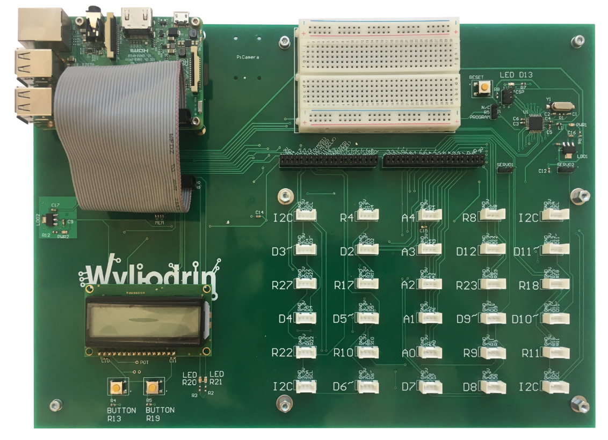
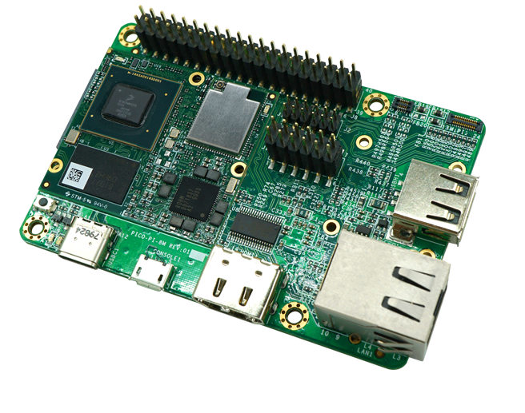
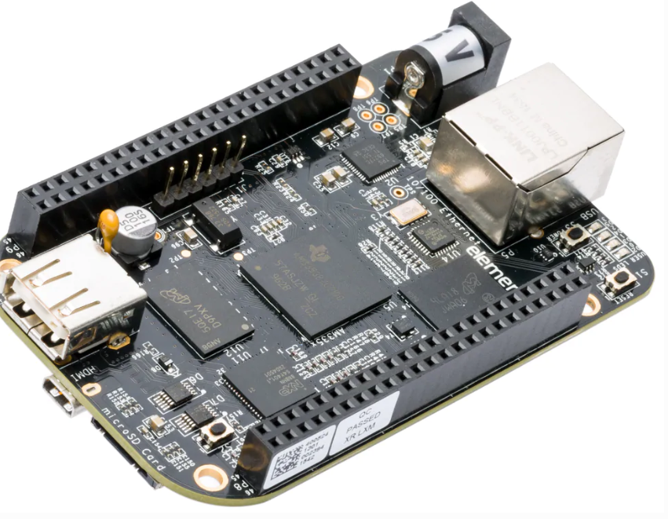

:orphan:

Boards Setup
================

|

Raspberry Pi
***************

This will show how to set up a Raspberry Pi device. 

.. image:: images/raspberrypi.png
	:align: center

|

Download the pre-configured image
^^^^^^^^^^^^^^^^^^^^^^^^^^^^^^^^^^^

The easiest way to set up a Raspberry Pi board so that it becomes available for Wyliodrin STUDIO is to download an image that is already configured.

Download the image for `Raspberry Pi Zero and Raspberry Pi 1 <https://wyliodrin-studio.s3.us-east-2.amazonaws.com/wyliodrin_studio_raspberrypi_zero_2019_11_21.zip>`_.

Download the image for `Raspberry Pi 2 <https://wyliodrin-studio.s3.us-east-2.amazonaws.com/wyliodrin_studio_raspberrypi_2019_11_27.zip>`_, `Raspberry Pi 3 <https://wyliodrin-studio.s3.us-east-2.amazonaws.com/wyliodrin_studio_raspberrypi_2019_11_27.zip>`_ and `Raspberry Pi 4 <https://wyliodrin-studio.s3.us-east-2.amazonaws.com/wyliodrin_studio_raspberrypi_2019_11_27.zip>`_.

Once the image downloaded and unziped, the only thing that you have to do is to :ref:`flash <flash>` it. After that, you can simply insert the SD card into the Raspberry Pi and your board should be visible within Wyliodrin STUDIO.

|

=========================

|

Set up the board manually
^^^^^^^^^^^^^^^^^^^^^^^^^^^^

However, you can also choose to configure the required image by yourself.

This will imply flashing an image with the OS (Raspbian), installing the STUDIO Supervisor container and setting up some configuration files.

Download the Raspbian image
"""""""""""""""""""""""""""

You will need to:

1. Download a Raspberry Pi Image
2. Install the Studio Supervisor
3. Setup a provisioning file

Raspbian is provided in two flavors, **Desktop** and **Lite**. The first one is packed with all the desktop user interface and applications while the second one contains only the minimum OS without any applications. The second one is just what we want for Studio, as we will deploy all the applications that want.

Download the `Raspbian Lite <https://www.raspberrypi.org/downloads/raspbian/>`_ image from the Raspberry Pi foundation. This is the standard OS for the Raspberry Pi provided by the manufacturer.

|

.. _flash:

Flash the image
"""""""""""""""""

The downloaded image needs to be flash (written) to an SD card. The minimum size of the SD card is 4 GB.

.. note::

	We recommend a minimum of 8 GB Class 10 SD Card. For small applications 4 GB might be enough.

To flash the image, you will need a special software. The recommended application is `Etcher <https://www.balena.io/etcher/>`_.

.. note::

	For Linux users, you may use the **dd** utility.

|

Install STUDIO Supervisor
"""""""""""""""""""""""""""

To be able to access the Studio network, the Raspberry Pi needs to run the STUDIO Supervisor software. The following tutorial will explain how to install it.

After writing the SD Card, insert it into the Raspberry Pi and start the Raspberry Pi. You will have to access it. This can be done either by:

* connecting the Raspberry Pi to the network and use a SSH to connect to it (If you are using **Raspberry Pi Zero** and you want to use SSH, you will need an USB-OTG adapter to get connected to the network.)
* connect a monitor and a keyboard to the Raspberry Pi

.. note::

	Using the SSH will require to enable it before. Insert the SD card into your computer. One (or two if Linux) partitions will show up. On the FAT partition (the first one), create and empty file named **ssh**.

**Install Dependencies**
--------------------------

The dependencies you will have to install are:

- *supervisor*: allows you to monitor processes related to a project
- *redis*: database management system
- *build-essential*: reference package for all the packages required for compilation
- *git*: required for the **npm install** command to download git included package
- *python3-pip*: python 3 programming language
- *docker*: containerization technology 

.. code-block:: bash
	
	sudo apt-get update
	sudo apt-get install -y supervisor redis build-essential git python3-pip docker-ce docker-ce-cli containerd.io

	# To enable the Notebook tab, you should also run
	sudo pip3 install redis pygments

|

**Install Node.js**
------------------------

The next step is to `install NodeJS <https://nodejs.org/en/download/>`_, considering the model of Raspberry Pi that you are using.

For **Pi Zero** and **Pi 1**, you will need the `ARMv6 <https://nodejs.org/dist/v10.16.3/node-v10.16.3-linux-armv6l.tar.xz>`_ version of Node.js, so you will run the following commands:

.. code-block:: bash

	wget https://nodejs.org/dist/v10.16.3/node-v10.16.3-linux-armv6l.tar.xz

	tar xvJf node-v10.16.3-linux-armv6l.tar.xz

	cd node-v10.16.3-linux-armv6l

	sudo cp -R * /usr

	sudo ln -s /usr/lib/node_modules /usr/lib/node

	cd ..

	rm -rf node-v10.16.3-linux-armv6l

For **Pi 2**, **Pi 3** and **Pi 4** models, the `ARMv7  <https://nodejs.org/dist/v10.16.3/node-v10.16.3-linux-armv7l.tar.xz>`_ version of Node.js is required, meaning that the bash commands are:

.. code-block:: bash

	wget https://nodejs.org/dist/v10.16.3/node-v10.16.3-linux-armv7l.tar.xz

	tar xvJf node-v10.16.3-linux-armv7l.tar.xz

	cd node-v10.16.3-linux-armv7l

	sudo cp -R * /usr

	sudo ln -s /usr/lib/node_modules /usr/lib/node

	cd ..

	rm -rf node-v10.16.3-linux-armv7l

|

**Install studio-supervisor**
-------------------------------

In order to install studio-supervisor, the following commands are required:

.. code-block:: bash

	sudo su -
	npm install -g --unsafe-perm studio-supervisor

	exit
	sudo mkdir /wyliodrin

|

**Write the supervisor script**
----------------------------------

Using nano editor, write the /etc/supervisor/conf.d/studiosupervisor.conf file with the following contents:

To start the editor, type

.. code-block:: bash

	sudo nano /etc/supervisor/conf.d/studio-supervisor.conf

.. code-block:: ini

	[program:studio-supervisor]
	command=/usr/bin/studio-supervisor raspberrypi
	home=/wyliodrin
	user=pi

Press Ctrl+X to save and exit the editor. Press Y when whether to save the file.

After that, you have to make the **/wyliodrin** directory your home directory:

.. code-block:: bash

	sudo chown pi:pi /wyliodrin
	cp /home/pi/.bashrc /wyliodrin/.bashrc

The final step is to refresh the board by running the command:

.. code-block:: bash

	
	sudo supervisorctl reload

**Install Docker**
----------------------------------

In order to install Docker, the following commands are required:
.. code-block:: bash

	sudo apt-get update && sudo apt-get upgrade
	curl -fsSL https://get.docker.com -o get-docker.sh
	sudo sh get-docker.sh
	sudo usermod -aG docker pi

Now, you'll have to restart the board using:
.. code-block:: bash

	sudo reboot
To see if the installation worked, check the Docker version:
.. code-block:: bash
	docker version

.. note::

	Docker is **NOT** available for **Raspberry pi 0**.

|

=====================

Connecting via web 
^^^^^^^^^^^^^^^^^^^

The connection of a Raspberry Pi board to the web version of Wyliodrin STUDIO demands an Internet connection and the creation of a file, **wyliodrin.json**, that will be written and stored on the SD card. The purpose of this configuration file is to keep a series of particular informations about the device and the platform, so the both instances be able to recognize and communicate with each other.

Acquiring the **wyliodrin.json** file assumes that you will have to launch the web version of the application and to click on the *Connect* button. After selecting the *New Device* option from the popup, a new dialog box will be opened and will ask you for the name of your new device.

|

Once you start typing the name of your device, a JSON structure is automatically generated depending on the entered data. The format of the object consists of the following properties:

.. list-table::

	* - Property title
	  - Description
	* - *token*
	  - unique identifier for the device, automatically assigned by the program
	* - *id*
	  - device name, updated as you change the name in the input box
	* - *server*
	  - endpoint

The content of this JSON structure has to be copied into a file that you will name **wyliodrin.json**, as mentioned before. Once the file created and saved, it has to be stored on the SD card, in the partition called **boot**. This action can be done by inserting the flashed card into your personal computer, which will lead to the automatic opening of the *boot* partition. 

After copying the configuration file to the destination indicated, you can insert the SD card into the Raspberry Pi, connect the board to the Internet and power it on. At this step, if you hit the *Connect* button of the web application, you should see your Raspberry Pi device into the list of available devices and by clicking on its name you will be able to connect it to the IDE.

|

Wyliolab Board
^^^^^^^^^^^^^^^^

If you are using the Wyliolab boards, you can download the pre-configured image for `Pi Zero and Pi 1 <https://wyliodrin-studio.s3.us-east-2.amazonaws.com/wyliodrin_studio_raspberrypi_zero_wyliolab_2019_11_27.zip>`_, or the image for `Pi 2 <https://wyliodrin-studio.s3.us-east-2.amazonaws.com/wyliodrin_studio_raspberrypi_wyliolab_2019_11_27.zip>`_, `Pi 3 <https://wyliodrin-studio.s3.us-east-2.amazonaws.com/wyliodrin_studio_raspberrypi_wyliolab_2019_11_27.zip>`_ and `Pi 4 <https://wyliodrin-studio.s3.us-east-2.amazonaws.com/wyliodrin_studio_raspberrypi_wyliolab_2019_11_27.zip>`_.

|

If you choose to continue the manual setup for the Raspberry Pi of the Wyliolab board, you should run the following commands:

.. code-block:: bash

	sudo pip3 install wyliozero

	sudo su -
	npm install -g --unsafe-perm studio-supervisor

	exit
	sudo nano /etc/supervisor/conf.d/studio-supervisor.conf

.. code-block:: ini

	[program:studio-supervisor]
	command=/usr/bin/studio-supervisor raspberrypi wyliolab
	home=/wyliodrin
	user=pi

After modifying the content of the *studio-supervisor.conf* file, you will have to run:

.. code-block:: bash

	sudo raspi-config

In the prompt that will be opened, you will have to select the fifth option(Interfacing Options), then in the Configuration Tool section you will have to pick *P6 Serial* in order to disable the shell and enable the serial port.

The final step before using the Wyliolab board is to reboot it.

=====================

Set up wireless
^^^^^^^^^^^^^^^^^^^

To set up your board wireless, please follow the steps in the link: `Set up wireless: <https://www.raspberrypi.org/documentation/configuration/wireless/headless.md>`_.

=========================

|

Pico-Pi.
**********

This will show how to set up a Pico-Pi device. 

To configure the Pico-Pi IMX8M board, it will be necessary to flash an image with the Ubuntu operating system, install the Studio-Supervisor container and set up some configuration files.

Download the pre-configured image
^^^^^^^^^^^^^^^^^^^^^^^^^^^^^^^^^^^

The easiest way to set up a Pico-Pi IMX8M board so that it becomes available for Wyliodrin STUDIO is to download an image that is already configured.

Download the image for `PicoPi IMX8M <https://wyliodrin-studio.s3.us-east-2.amazonaws.com/wyliodrin_studio_picopi_imx8m_2019_09_17.zip>`_.

Once the image downloaded and unziped, the only thing that you have to do is to :ref:`flash <flashubuntu>` it. After that, your Pico-Pi board should be visible within Wyliodrin STUDIO.

|

Set up the board manually
^^^^^^^^^^^^^^^^^^^^^^^^^^^^^

Enable the USB mass storage device
""""""""""""""""""""""""""""""""""""""

The first step is to connect the Pico-Pi device directly to your computer, using the micro USB and USB type C cables.

If your computer is running on **Linux**, you should be able to see the .................

If you are using **Windows**, you will need an additional driver to see the COM ports: 

https://www.silabs.com/products/development-tools/software/usb-to-uart-bridge-vcp-drivers

After downloading and extracting the files, you should open the Device Manager, right click on the Ports section and select the driver. By the end, you should be able to see the following devices:

.. image:: images/devicemanager.png
	:align: center

|

Export the EMMC device as mass storage to the host computer
"""""""""""""""""""""""""""""""""""""""""""""""""""""""""""""""

**1. Set up the serial terminal**

As the Pico-Pi is already directly connected to your computer, you have to get a serial terminal program running. For Linux, we suggest you to use **screen**, but any other serial terminal should work.

If you are using Windows, we recommend you to download and open `Putty <https://www.putty.org/>`_ and customize the session with the following options:

.. list-table::

	* - Connection type
	  - Serial
	* - Serial line
	  - COM port for Pico-Pi, in this example COM9
	* - Speed
	  - 115200

Once the session started, it will load U-boot and you will be able to see the text "Hit any key to stop autoboot:". Pressing on a key will stop the boot process and a open a boot prompt.

.. note::

	If the boot prompt doesn't appear, you should reboot the board by pressing the Restart button.

|

**2. List the accessible devices**

In order to get a list with the MMC devices, you should run the following command:

.. code-block:: bash

	mmc list

The output should look like this:

|

**3. Export the EMMC device**

To export the Pico-Pi device to the host computer, you will run the next command:

.. code-block:: bash

	ums 0 mmc 0

The output will be:

.. code-block:: bash

	UMS: LUN 0, dev 1, hwpart 0, sector 0x0, count 0xe90000
	/

A rotating cursor will be visible while the USB Mass Storage is running and the boot prompt can be exited by pressing CTRL+C.

If you followed this steps, a new USB device should appear on your PC and you will use it to load the Ubuntu image.

|

Load the image into EMMC
""""""""""""""""""""""""""""""""""""

Download the `Ubuntu <ftp://ftp.technexion.net/demo_software/pico-imx8mq/pico-imx8m_pico-pi-imx8m_ubuntu-18.04_QCA9377_hdmi_20181109.zip>`_ image from the TechNexion foundation. This is the standard OS for the Pico-Pi IMX8M provided by the manufacturer.

.. _flashubuntu:

Flash the Ubuntu image
--------------------------

The downloaded image needs to be flash (written) directly to the Pico Pi. 

To flash the image, you will need a special software. The recommended application is `Etcher <https://www.balena.io/etcher/>`_.

Once the Ubuntu image flashed on your Pico-Pi board, you will have to reboot the device by pressing on its Restart button and wait for it to boot the Ubuntu OS without pressing any key. When the boot process is finished, you will be asked to provide the login credentials. For this type of device, the login username is *ubuntu*, same as the password, *ubuntu*.

|

Install STUDIO Supervisor
----------------------------

To be able to access the Studio network, the Pico-Pi needs to run the STUDIO Supervisor software. The following tutorial will explain how to install it.

After writing the image on the device, you will have to connect the Pico-Pi to the network and use a SSH to connect to it.

**Install Dependencies**
--------------------------

The dependencies you will have to install are:

- *supervisor*: allows you to monitor processes related to a project
- *redis*: database management system
- *build-essential*: reference package for all the packages required for compilation
- *git*: required for the **npm install** command to download git included package
- *python3-pip*: python 3 programming language

.. code-block:: bash
	
	sudo apt-get update
	sudo apt-get install -y supervisor redis build-essential git python3-pip

	# To enable the Notebook tab, you should also run
	sudo pip3 install redis pygments

|

**Install Node.js**
------------------------

The next step is to `install NodeJS <https://nodejs.org/en/download/>`_.

For the Pico-Pi IMX8M you will need the `ARMv8 <https://nodejs.org/dist/v10.16.3/node-v10.16.3-linux-arm64.tar.xz>`_ version of Node.js, so you will run the following commands:

.. code-block:: bash

	sudo apt-get install wget
	wget https://nodejs.org/dist/v10.16.3/node-v10.16.3-linux-arm64.tar.xz

	tar xvJf node-v10.16.3-linux-arm64.tar.xz

	cd node-v10.16.3-linux-arm64

	sudo cp -R * /usr

	sudo ln -s /usr/lib/node_modules /usr/lib/node

	cd ..

	rm -rf node-v10.16.3-linux-arm64

|

**Install studio-supervisor**
-------------------------------

In order to install studio-supervisor, the following commands are required:

.. code-block:: bash

	sudo su -
	npm install -g --unsafe-perm studio-supervisor

	exit
	sudo mkdir /wyliodrin

|

**Write the supervisor script**
----------------------------------

Using nano editor, write the /etc/supervisor/conf.d/studiosupervisor.conf file with the following contents:

To start the editor, type

.. code-block:: bash

	sudo apt-get install nano
	sudo nano /etc/supervisor/conf.d/studio-supervisor.conf

.. code-block:: ini

	[program:studio-supervisor]
	command=/usr/bin/studio-supervisor picopi
	home=/wyliodrin
	user=ubuntu

Press Ctrl+X to save and exit the editor. Press Y when whether to save the file.

After that, you have to make the **/wyliodrin** directory your home directory:

.. code-block:: bash

	sudo chown ubuntu:ubuntu /wyliodrin
	cp /home/ubuntu/.bashrc /wyliodrin/.bashrc

.. note::

	While using the Pico-Pi device, you will need to run some commands as root, meaning that each time you will use **sudo**, the system will ask you to input the passwork. In order to be able to run the sudo command without entering a password, you will have to configure a setting.

	You will have to run the **sudo visudo** command, which will open the *etc/sudoers* file. You will have to modify the content by moving the next line at the end of the file:

		*ubuntu  ALL=(ALL) NOPASSWD: ALL*

If you are using Wyliodrin STUDIO locally, you will need to install the following utilities:

.. code-block:: bash

	sudo apt-get install avahi-daemon
	sudo apt-get install openssh-server

The final step is to refresh the board by running the command:

.. code-block:: bash

	
	sudo supervisorctl reload

|

Connecting via web 
^^^^^^^^^^^^^^^^^^^^^^

The connection of a Pico-Pi IMX8M board to the web version of Wyliodrin STUDIO demands an Internet connection and the creation of a file, **wyliodrin.json**, that will be written and stored on the device. The purpose of this configuration file is to keep a series of particular informations about the device and the platform, so the both instances be able to recognize and communicate with each other.

Acquiring the **wyliodrin.json** file assumes that you will have to launch the web version of the application and to click on the *Connect* button. After selecting the *New Device* option from the popup, a new dialog box will be opened and will ask you for the name of your new device.

|

Once you start typing the name of your device, a JSON structure is automatically generated depending on the entered data. The format of the object consists of the following properties:

.. list-table::

	* - Property title
	  - Description
	* - *token*
	  - unique identifier for the device, automatically assigned by the program
	* - *id*
	  - device name, updated as you change the name in the input box
	* - *server*
	  - endpoint

The content of this JSON structure has to be copied into a file that you will name **wyliodrin.json**, as mentioned before. Once the file created and saved, it has to be stored on **boot** partition of your Pico-Pi. 

To mount the boot partition, you will have to run the following command:

.. code-block:: bash

	sudo nano /etc/fstab

You will have to add the following text content within the *fstab* file:

::
	
	/dev/mmcblk0p1  /boot   auto    ro      0       0

After copying the configuration file to the destination indicated, you can reboot your board using the Restart button. At this step, if you hit the *Connect* button of the web application, you should see your Pico-Pi device into the list of available devices and by clicking on its name you will be able to connect it to the IDE.

|

==================

|

Beaglebone Black
*********************

This tutorial will show you how to set up a Beaglebone Black device.

Download the pre-configured image
^^^^^^^^^^^^^^^^^^^^^^^^^^^^^^^^^^^

The easiest way to set up a BeagleBone Black board so that it becomes available for Wyliodrin STUDIO is to download an image that is already configured.

Download the image for `BeagleBone Black <https://wyliodrin-studio.s3.us-east-2.amazonaws.com/wyliodrin_studio_beagleboneblack_2019_09_17.zip>`_.

Once the image downloaded and unziped, the only thing that you have to do is to :ref:`flash <flashBeagle>` it. After that, you can simply insert the SD card into the BeagleBone Black and your board should be visible within Wyliodrin STUDIO.

|
|

Set up the board manually
^^^^^^^^^^^^^^^^^^^^^^^^^^^^

However, you can also choose to configure the required image by yourself.

This will imply flashing an image with the OS (Debian), installing the STUDIO Supervisor container and setting up some configuration files.

Download the Debian image
"""""""""""""""""""""""""""

You will need to:

1. Download a Debian Image
2. Install the Studio Supervisor
3. Setup a provisioning file

Download the `Debian IoT <https://debian.beagleboard.org/images/bone-debian-9.5-iot-armhf-2018-10-07-4gb.img.xz>`_ image from the Beagle Board foundation. This is the standard OS for the BeagleBone Black provided by the manufacturer.

|

.. _flashBeagle:

Flash the image
"""""""""""""""""

The downloaded image needs to be flash (written) to an SD card. The minimum size of the SD card is 4 GB.

.. note::

	We recommend a minimum of 8 GB Class 10 SD Card. For small applications 4 GB might be enough.

To flash the image, you will need a special software. The recommended application is `Etcher <https://www.balena.io/etcher/>`_.

.. note::

	For Linux users, you may use the **dd** utility.

|

Install STUDIO Supervisor
"""""""""""""""""""""""""""

To be able to access the Studio network, the BeagleBone Black needs to run the STUDIO Supervisor software. The following tutorial will explain how to install it.

After writing the SD Card, insert it into the board and start the device. You will have to access it. This can be done either by:

* connecting the BeagleBone Black to the network and use a SSH to connect to it 
* connect a monitor and a keyboard to the board

If you are using SSH, you will have to input 192.168.7.2 as the host IP address and then login with the appropriate credentials:

username: *debian*

password: *temppwd*

**Stop additional services**
---------------------------------

The BeagleBone Black image has several servers started. These are used mainly for development. Run the commands to stop them:

.. code-block:: bash

	sudo systemctl disable bonescript.service
	sudo systemctl disable bonescript-autorun.service
	sudo systemctl disable bonescript.socket
	sudo systemctl disable apache2
	sudo systemctl disable cloud9.service
	sudo systemctl disable cloud9.socket
	sudo systemctl disable getty@tty1
	sudo systemctl disable node-red.socket

**Install Dependencies**
--------------------------

The dependencies you will have to install are:

- *supervisor*: allows you to monitor processes related to a project
- *redis*: database management system
- *build-essential*: reference package for all the packages required for compilation
- *git*: required for the **npm install** command to download git included package
- *python3-pip*: python 3 programming language

.. code-block:: bash
	
	sudo apt-get update
	sudo apt-get install -y supervisor redis-server build-essential git python3-pip

	# To enable the Notebook tab, you should also run
	sudo pip3 install redis pygments

|

**Install Node.js**
------------------------

The next step is to `install NodeJS <https://nodejs.org/en/download/>`_.

For BeagleBone Black, the `ARMv7  <https://nodejs.org/dist/v10.16.3/node-v10.16.3-linux-armv7l.tar.xz>`_ version of Node.js is required, meaning that the bash commands are:

.. code-block:: bash

	wget https://nodejs.org/dist/v10.16.3/node-v10.16.3-linux-armv7l.tar.xz

	tar xvJf node-v10.16.3-linux-armv7l.tar.xz

After installing and unziping Node, you should reboot the board and restart the session and remove old node:

.. code-block:: bash

	sudo rm /usr/bin/npm
	sudo rm /usr/bin/npx
	sudo rm -f /usr/lib/node_modules

Continue the configuration by running the following commands:

.. code-block:: bash

	cd node-v10.16.3-linux-armv7l

	sudo cp -R * /usr

	sudo ln -s /usr/lib/node_modules /usr/lib/node

	cd ..

	rm -rf node-v10.16.3-linux-armv7l

|

**Install studio-supervisor**
-------------------------------

In order to install studio-supervisor, the following commands are required:

.. code-block:: bash

	sudo su -
	npm install -g --unsafe-perm studio-supervisor

	exit
	sudo mkdir /wyliodrin

|

**Write the supervisor script**
----------------------------------

Using nano editor, write the /etc/supervisor/conf.d/studiosupervisor.conf file with the following contents:

To start the editor, type

.. code-block:: bash

	sudo nano /etc/supervisor/conf.d/studio-supervisor.conf

.. code-block:: ini

	[program:studio-supervisor]
	command=/usr/bin/studio-supervisor beaglebone
	home=/wyliodrin
	user=debian

Press Ctrl+X to save and exit the editor. Press Y when whether to save the file.

After that, you have to make the **/wyliodrin** directory your home directory:

.. code-block:: bash

	sudo chown debian:debian /wyliodrin
	cp /home/debian/.bashrc /wyliodrin/.bashrc

.. note::

	While using the Pico-Pi device, you will need to run some commands as root, meaning that each time you will use **sudo**, the system will ask you to input the passwork. In order to be able to run the sudo command without entering a password, you will have to configure a setting.

	You will have to run the **sudo visudo** command, which will open the *etc/sudoers* file. You will have to modify the content by moving the next line at the end of the file:

		*debian  ALL=(ALL) NOPASSWD: ALL*

The final step is to refresh the board by running the command:

.. code-block:: bash

	
	sudo supervisorctl reload

|

Connecting via web 
^^^^^^^^^^^^^^^^^^

The connection of a BeagelBone Black board to the web version of Wyliodrin STUDIO demands an Internet connection and the creation of a file, **wyliodrin.json**, that will be written and stored on the SD card. The purpose of this configuration file is to keep a series of particular informations about the device and the platform, so the both instances be able to recognize and communicate with each other.

Acquiring the **wyliodrin.json** file assumes that you will have to launch the web version of the application and to click on the *Connect* button. After selecting the *New Device* option from the popup, a new dialog box will be opened and will ask you for the name of your new device.

|

Once you start typing the name of your device, a JSON structure is automatically generated depending on the entered data. The format of the object consists of the following properties:

.. list-table::

	* - Property title
	  - Description
	* - *token*
	  - unique identifier for the device, automatically assigned by the program
	* - *id*
	  - device name, updated as you change the name in the input box
	* - *server*
	  - endpoint

The content of this JSON structure has to be copied into a file that you will name **wyliodrin.json**, as mentioned before. 

To add this file, you will have to connect the device to Wyliodrin STUDIO, open the **Shell** tab and run:

.. code-block:: bash

	sudo nano /boot/wyliodrin.json

After creating the configuration file to the destination indicated, you can hit the *Connect* button of the web application. At this point, you should see your BeagleBone Black device into the list of available devices and by clicking on its name you will be able to connect it to the IDE.

|

=========================

|

Udoo Neo
**********

This tutorial will show you how to set up a Udoo Neo device.

.. image:: images/udooneo.png
	:align: center

.. Download the pre-configured image
.. ^^^^^^^^^^^^^^^^^^^^^^^^^^^^^^^^^^^

.. The easiest way to set up a Udoo Neo board so that it becomes available for Wyliodrin STUDIO is to download an image that is already configured.

.. Download the image for `Udoo Neo <https://wyliodrin-studio.s3.us-east-2.amazonaws.com/wyliodrin_studio_beaglebone_black_2019_09_17.zip>`_.

.. Once the image downloaded and unziped, the only thing that you have to do is to :ref:`flash <flashUdoo>` it. After that, you can simply insert the SD card into the Udoo Neo and your board should be visible within Wyliodrin STUDIO.

.. |

|

Set up the board manually
^^^^^^^^^^^^^^^^^^^^^^^^^^^^

You can choose to configure the required image by yourself.

This will imply flashing an image with the OS (Ubuntu), installing the STUDIO Supervisor container and setting up some configuration files.

Download the Ubuntu image
"""""""""""""""""""""""""""

You will need to:

1. Download a Ubuntu Image
2. Install the Studio Supervisor
3. Setup a provisioning file

Download the `Ubuntu 16 <https://drive.google.com/file/d/1BkJCJrtGcZWHHQtXeOLIWPspK3jqwiBZ/view>`_ image for Udoo Neo.

|

.. _flashUdoo:

Flash the image
"""""""""""""""""

The downloaded image needs to be flash (written) to an SD card. The minimum size of the SD card is 4 GB.

.. note::

	We recommend a minimum of 8 GB Class 10 SD Card. For small applications 4 GB might be enough.

To flash the image, you will need a special software. The recommended application is `Etcher <https://www.balena.io/etcher/>`_.

.. note::

	For Linux users, you may use the **dd** utility.

|

Install STUDIO Supervisor
"""""""""""""""""""""""""""

To be able to access the Studio network, the Udoo Neo needs to run the STUDIO Supervisor software. The following tutorial will explain how to install it.

After writing the SD Card, insert it into the board and start the device. You will have to access it. This can be done either by:

* connecting the Udoo Neo to the network and use a SSH to connect to it 
* connect a monitor and a keyboard to the board

If you are using SSH, you will have to input 192.168.7.2 as the host IP address and then login with the appropriate credentials:

username: *udooer*

password: *udooer*

**Install Dependencies**
--------------------------

The dependencies you will have to install are:

- *supervisor*: allows you to monitor processes related to a project
- *redis*: database management system
- *build-essential*: reference package for all the packages required for compilation
- *git*: required for the **npm install** command to download git included package
- *python3-pip*: python 3 programming language

.. code-block:: bash
	
	sudo apt-get update
	sudo apt-get install -y supervisor redis-server build-essential git python3-pip

	# To enable the Notebook tab, you should also run
	sudo pip3 install redis pygments

|

**Install Node.js**
------------------------

The next step is to `install NodeJS <https://nodejs.org/en/download/>`_.

For Udoo Neo, the `ARMv7  <https://nodejs.org/dist/v10.16.3/node-v10.16.3-linux-armv7l.tar.xz>`_ version of Node.js is required, meaning that the bash commands are:

.. code-block:: bash

	wget https://nodejs.org/dist/v10.16.3/node-v10.16.3-linux-armv7l.tar.xz

	tar xvJf node-v10.16.3-linux-armv7l.tar.xz

After installing and unziping Node, you should reboot the board and restart the session and remove old node:

.. code-block:: bash

	sudo rm /usr/bin/npm
	sudo rm /usr/bin/npx
	sudo rm /usr/lib/node_modules

Continue the configuration by running the following commands:

.. code-block:: bash

	cd node-v10.16.3-linux-armv7l

	sudo cp -R * /usr

	sudo ln -s /usr/lib/node_modules /usr/lib/node

	cd ..

	rm -rf node-v10.16.3-linux-armv7l

|

**Install studio-supervisor**
-------------------------------

In order to install studio-supervisor, the following commands are required:

.. code-block:: bash

	sudo su -
	npm install -g --unsafe-perm studio-supervisor

	exit
	sudo mkdir /wyliodrin

|

**Write the supervisor script**
----------------------------------

Using nano editor, write the /etc/supervisor/conf.d/studiosupervisor.conf file with the following contents:

To start the editor, type

.. code-block:: bash

	sudo nano /etc/supervisor/conf.d/studio-supervisor.conf

.. code-block:: ini

	[program:studio-supervisor]
	command=/usr/bin/studio-supervisor udooneo
	home=/wyliodrin
	user=udooer

Press Ctrl+X to save and exit the editor. Press Y when whether to save the file.

After that, you have to make the **/wyliodrin** directory your home directory:

.. code-block:: bash

	sudo chown udooer:udooer /wyliodrin
	cp /home/udooer/.bashrc /wyliodrin/.bashrc

The final step is to refresh the board by running the command:

.. code-block:: bash

	
	sudo supervisorctl reload

|

Connecting via web 
^^^^^^^^^^^^^^^^^^^^^

The connection of a Udoo Neo board to the web version of Wyliodrin STUDIO demands an Internet connection and the creation of a file, **wyliodrin.json**, that will be written and stored on the SD card. The purpose of this configuration file is to keep a series of particular informations about the device and the platform, so the both instances be able to recognize and communicate with each other.

Acquiring the **wyliodrin.json** file assumes that you will have to launch the web version of the application and to click on the *Connect* button. After selecting the *New Device* option from the popup, a new dialog box will be opened and will ask you for the name of your new device.

|

Once you start typing the name of your device, a JSON structure is automatically generated depending on the entered data. The format of the object consists of the following properties:

.. list-table::

	* - Property title
	  - Description
	* - *token*
	  - unique identifier for the device, automatically assigned by the program
	* - *id*
	  - device name, updated as you change the name in the input box
	* - *server*
	  - endpoint

The content of this JSON structure has to be copied into a file that you will name **wyliodrin.json**, as mentioned before. 

To add this file, you will have to connect the device to Wyliodrin STUDIO, open the **Shell** tab and run:

.. code-block:: bash

	sudo nano /boot/wyliodrin.json

After creating the configuration file to the destination indicated, you can hit the *Connect* button of the web application. At this point, you should see your Udoo Neo device into the list of available devices and by clicking on its name you will be able to connect it to the IDE.
