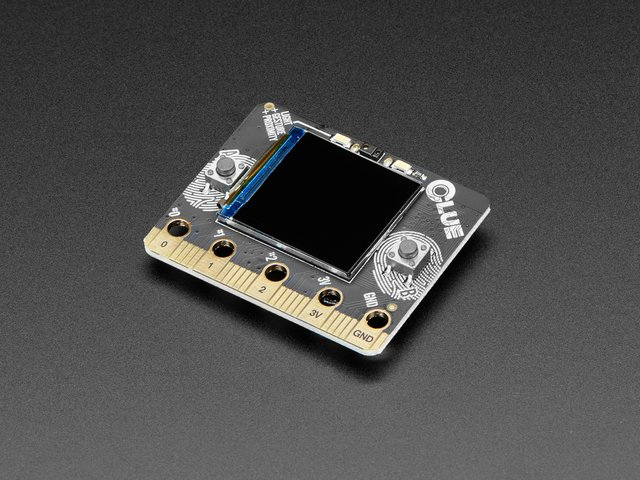

Adafruit CLUE (CircuitPython)
======================================

Adafruit CLUE is a board similar to the `Micro:Bit <https://microbit.org>`_, 
but based on the Nordic nRF52840 SoC. It includes the following sensors:

- 9 axis inertial LSM6DS33 + LIS3MDL sensor
- humidity and temperature sensor
- barometric sensor
- microphone
- gesture, proximity, light color and light intensity sensor

It also has a 240x240 LCD display.

This documentation describes how to use the `Adafruit CLUE <https://learn.adafruit.com/adafruit-clue>`_ with `CircuitPython <https://circuitpython.org/>`_.

Adafruit CLUE can be used with both the offline and the web version (Google Chrome only) of WyliodrinSTUDIO.

Installing CircuitPython
************************

You will have to follow these steps:

1. Download CircuitPython
2. Flash CircuitPython to the board
3. Load the libraries

Download CircuitPython
^^^^^^^^^^^^^^^^^^^^^^

CircuitPython is an Adafruit modified version of MicroPython. Adafruit provides a downloadable
image for several boards. You have to download the `Adafruit CLUE CircuitPython image <https://circuitpython.org/board/clue_nrf52840_express>`_.

Please download the latest stable version. This should be a UF2 file.

Flash the CircuitPython
^^^^^^^^^^^^^^^^^^^^^^^

The UF2 file that you have downloaded at the previous step has to be written to the board. Adafruit has provided a very
easy method to do that. Connect your board to your computer using a USB cable and double press the button on tha back
of the board (tha part that does not have a display). The Neopixel LED should start flashing green.

Double pressing the button on the back will put the board into DFU mode. This will display connect to your computer a 
USB drive called BOOT. Copy and paste the downloaded UF2 file to this drive. This will flash CircuitPython to the board.

Offline WyliodrinSTUDIO
***********************

Connect the board to your computer using the USB cable. Run Wyliodrin STUDIO and open the Connect menu.
You should have an option called Adafruit Industries or Adafruit CLUE. Select that board. A popup with some 
options will appear, just use the default options and click Connect.

You should be connected to the board.

Web WyliodrinSTUDIO
*******************

.. note::
	Using the web version requires Google Chrome with some epxerimental features enabled

To use the Adafruit CLUE in the web version, you will have to use Google Chrome and enable Experimental Features.

To enable Experimental Features in Google Chrome, follow the steps:

1. In the Chrome search bar write `chrome: // flags`
2. Search the search bar for the flags: `#enable-experimental-web-platform-features`
3. Set the ENABLE flag for `Experimental Web Platform features`
4. At the bottom right click RELAUNCH button
5. Restart the browser

After enabeling Experimental Features, connect the board to your computer using the USB cable and click the Connect menu.
Select the MicroPython option. A popup will appear, you can safly use the default settings and click Connect. The browser will 
ask you to select the serial port. Select the port that has the `Adafruit` word in its name.

You should be connected to the board.