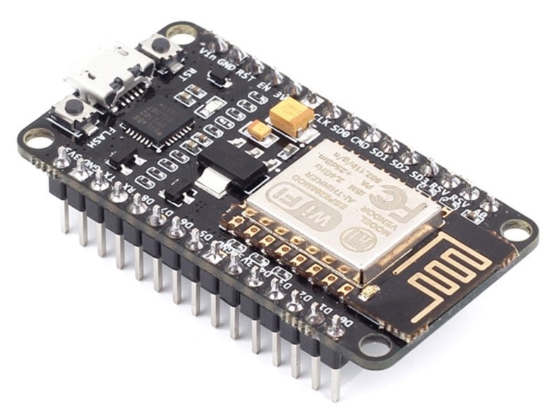
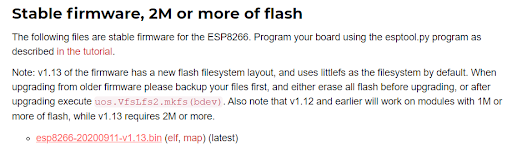
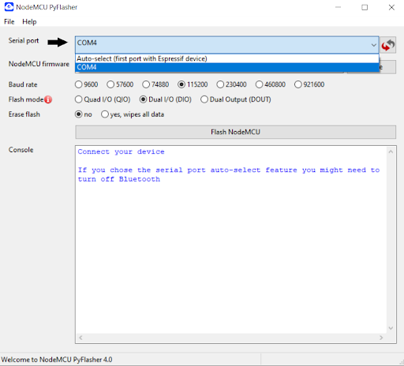
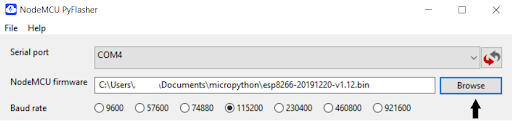
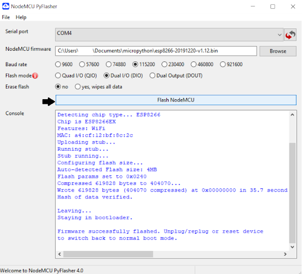
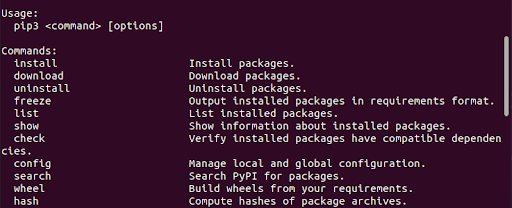
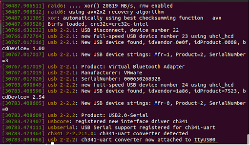
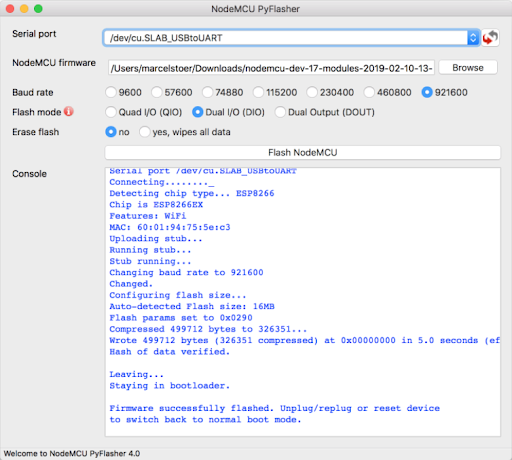

ESP 8266 (MicroPython)
=================================

This will show how to set up a ESP8266 device.

|

Windows
***********
-----------------------------------------------

1. Download Micropython firmware
^^^^^^^^^^^^^^^^^^^^^^^^^^^^^^^^^

Open a browser and type this link: https://micropython.org/download/esp8266/,
then go install the latest version (without opening it). 

*Suggestion*: create a folder on your computer named “esp8266” or “micropython” and download it there.

2. Install NodeMCU PyFlasher and flashing Micropython on ESP8266
^^^^^^^^^^^^^^^^^^^^^^^^^^^^^^^^^^^^^^^^^^^^^^^^^^^^^^^^^^^^^^^^^

NodeMCU PyFlasher is a new GUI tool to flash NodeMCU based on esptool.py and wxPython. It is available for Windows and for macOS.
First, you have to connect the ESP8266 to your computer. Take the USB cable from the kit and Put the USB-C in one of your ports and then connect the micro-USB to the microcontroller.

Check this link `install NodeMCU <https://github.com/marcelstoer/nodemcu-pyflasher/releases>`_, scroll down to the executables. If you have Windows 10 choose the first one (*NodeMCU-PyFlasher-4.0-x64.exe*), if you have Windows 7 choose the second one (*NodeMCU-PyFlasher-4.0-x86.exe*).

After the installation will be completed, click on the NodeMCU PyFlasher .exe file and you should have a similar window:

First, you have to choose your serial port, in this case it is “COM4”, (the number after “COM” is based on the port that you chose) like in the image below. 

If you want to check which port you chose go in the Open Start menu and type “Device Manager”, then check Ports section (the number after “COM” is based on the port that you chose).

Succeeding, you have to click on “Browse” and go to the folder where you installed Micropython and choose the .bin file. Next you should chose the “Baud rate” like in the image below:

If you encounter errors, you need to reduce the baud rate (for example 9600 or up down). “1115200” is the speed read by serial port

As final step, you have to click on the button *“Flash NodeMCU”*.

**Congratulations**, now you have Micropython on your ESP8266!

|

Linux
*******
---------------------------------------------

2.1 Install Python
^^^^^^^^^^^^^^^^^^

First, you should check if you have python3 installed. For that open Terminal and type: 
	
	**$ python3 --version**

If the python version appears, you can skip the installation go to Verify PIP is installed. You might have a newer version of python

If you do not have python installed, you have to use this command:

	**$ sudo apt install python3**

At the moment, you should have python3. In order to check if the installation is completed, type: 

	**$ python3** 

Then try to code in python, like in the image below:

.. image:: images/esp8266/verify_python.png
	:align: center

*To exit python press Ctrl+Z.*

Verify PIP is installed

Open Terminal and type :
	
	**$ pip3**

If it is installed you should have a similar output :

But if it has not been installed, you have to use the commands:
 
	**$ sudo apt-get update**

	**$ sudo apt-get install python-pip**

	**$ sudo pip install --upgrade pip**

**Congratulations**, now you have installed Python!

2.2 Download Micropython firmware
^^^^^^^^^^^^^^^^^^^^^^^^^^^^^^^^^

Open a browser and type this link: https://micropython.org/download/esp8266/,
then go install the latest version (without opening it). 

*Suggestion*: create a folder on your computer named “esp8266” or “micropython” and download it there.

3. Flashing Micropython on ESP8266
^^^^^^^^^^^^^^^^^^^^^^^^^^^^^^^^^^^

Open Terminal and use the command:
 
 **$ pip3 install esptool**

Then check the esptool installation by typing:

	**$ esptool**

Connect the ESP8266 to your computer. Take the USB cable from the kit and Put the USB-C in one of your ports and then connect the micro-USB to the microcontroller.

Succeeding, go to the folder where you installed Micropython firmware. Use **$ls** command to list files and directories and **$ cd** to change the current working directory.

Type **$ dmesg** to see the port, you should have a similar output:

In this case the port is *ttyUSB0*.

After, use the command:

	**$ esptool.py --port /dev/ttyUSB0 erase_flash**

for erasing the flash memory on the board. Instead of *ttyUSB0* you might have another port. You have to put the one that you have seen earlier.

Press the reset (RST) button from your ESP8266, then use the command: 

	**$ esptool.py --port /dev/ttyUSB0 --baud 460800 write_flash --flash_size=detect 0 esp8266-20170108-v1.8.7.bin**

Keep in mind to put the port that you used in the previous command and pay attention to the version of Micropython that you have installed. Instead of *“esp8266-20170108-v1.8.7.bin”* you might have another version. You must replace it in the command. If you encounter errors, you need to reduce the baud rate (for example 115200 or up down).

Next, connect to the serial console with command:

	**$ screen /dev/ttyUSB0 115200**

“115200” is the speed read by serial port. To close it type **Ctrl+D** or **Ctrl+a** followed by **Ctrl+\\**.

**Congratulations**, now you have Micropython on your ESP8266!

|

macOS
*********
---------------------------------------------

1. Download Micropython firmware
^^^^^^^^^^^^^^^^^^^^^^^^^^^^^^^^^

Open a browser and type this link: https://micropython.org/download/esp8266/,
then go install the latest version (without opening it). 

*Suggestion*: create a folder on your computer named “esp8266” or “micropython” and download it there.

3.2 Install NodeMCU PyFlasher and flashing Micropython on ESP8266
^^^^^^^^^^^^^^^^^^^^^^^^^^^^^^^^^^^^^^^^^^^^^^^^^^^^^^^^^^^^^^^^^
NodeMCU PyFlasher is a new GUI tool to flash NodeMCU based on esptool.py and wxPython.

First, you have *to connect the ESP8266 to your computer*. Take the USB cable from the kit and Put the USB-C in one of your ports and then connect the micro-USB to the microcontroller.

Check this link `install NodeMCU <https://github.com/marcelstoer/nodemcu-pyflasher/releases>`_, if you have High Sierra. Scroll down to the executables and click on the third executable (*NodeMCU-PyFlasher-4.0.dmg*).

After the installation will be completed, click on the NodeMCU PyFlasher .exe file and you should have a similar window: 

First, you have to choose your serial port, in this case the port is: “/dev/cu.SLAB_USBtoUART”

Succeeding, you have to click on “Browse” and go to the folder where you installed Micropython and choose the .bin file. Next you should choose the *Baud rate* like in the image above

If you encounter errors, you need to reduce the baud rate (for example 1115200 or up down). “921600” is the speed read by serial port.

As final step, you have to click on the button *“Flash NodeMCU”*.

**Congratulations**, now you have Micropython on your ESP8266!

|
