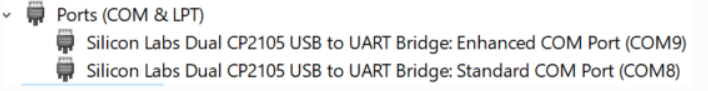

Pico-Pi
**********

This will show how to set up a Pico-Pi device. 

.. image:: images/picopi/picopi.png
	:align: center

To configure the Pico-Pi IMX8M board, it will be necessary to flash an image with the Ubuntu operating system, install the Studio-Supervisor container and set up some configuration files.

Download the pre-configured image
^^^^^^^^^^^^^^^^^^^^^^^^^^^^^^^^^^^

The easiest way to set up a Pico-Pi IMX8M board so that it becomes available for Wyliodrin STUDIO is to download an image that is already configured.

Download the image for `PicoPi IMX8M <https://wyliodrinstudio.s3.eu-central-1.amazonaws.com/images/wyliodrin_studio_picopi_imx8m_2019_09_17.zip>`_.

Once the image downloaded and unziped, the only thing that you have to do is to :ref:`flash <flashubuntu>` it. After that, your Pico-Pi board should be visible within Wyliodrin STUDIO.

|

Set up the board manually
^^^^^^^^^^^^^^^^^^^^^^^^^^^^^

Enable the USB mass storage device
""""""""""""""""""""""""""""""""""""""

The first step is to connect the Pico-Pi device directly to your computer, using the micro USB and USB type C cables.

If your computer is running on **Linux**, you should be able to see the .................

If you are using **Windows**, you will need an additional driver to see the COM ports: 

https://www.silabs.com/products/development-tools/software/usb-to-uart-bridge-vcp-drivers

After downloading and extracting the files, you should open the Device Manager, right click on the Ports section and select the driver. By the end, you should be able to see the following devices:

|

Export the EMMC device as mass storage to the host computer
"""""""""""""""""""""""""""""""""""""""""""""""""""""""""""""""

**1. Set up the serial terminal**

As the Pico-Pi is already directly connected to your computer, you have to get a serial terminal program running. For Linux, we suggest you to use **screen**, but any other serial terminal should work.

If you are using Windows, we recommend you to download and open `Putty <https://www.putty.org/>`_ and customize the session with the following options:

.. list-table::

	* - Connection type
	  - Serial
	* - Serial line
	  - COM port for Pico-Pi, in this example COM9
	* - Speed
	  - 115200

Once the session started, it will load U-boot and you will be able to see the text "Hit any key to stop autoboot:". Pressing on a key will stop the boot process and a open a boot prompt.

.. note::

	If the boot prompt doesn't appear, you should reboot the board by pressing the Restart button.

|

**2. List the accessible devices**

In order to get a list with the MMC devices, you should run the following command:

.. code-block:: bash

	mmc list

The output should look like this:

|

**3. Export the EMMC device**

To export the Pico-Pi device to the host computer, you will run the next command:

.. code-block:: bash

	ums 0 mmc 0

The output will be:

.. code-block:: bash

	UMS: LUN 0, dev 1, hwpart 0, sector 0x0, count 0xe90000
	/

A rotating cursor will be visible while the USB Mass Storage is running and the boot prompt can be exited by pressing CTRL+C.

If you followed this steps, a new USB device should appear on your PC and you will use it to load the Ubuntu image.

|

Load the image into EMMC
""""""""""""""""""""""""""""""""""""

Download the `Ubuntu <ftp://ftp.technexion.net/demo_software/pico-imx8mq/pico-imx8m_pico-pi-imx8m_ubuntu-18.04_QCA9377_hdmi_20181109.zip>`_ image from the TechNexion foundation. This is the standard OS for the Pico-Pi IMX8M provided by the manufacturer.

.. _flashubuntu:

Flash the Ubuntu image
--------------------------

The downloaded image needs to be flash (written) directly to the Pico Pi. 

To flash the image, you will need a special software. The recommended application is `Etcher <https://www.balena.io/etcher/>`_.

Once the Ubuntu image flashed on your Pico-Pi board, you will have to reboot the device by pressing on its Restart button and wait for it to boot the Ubuntu OS without pressing any key. When the boot process is finished, you will be asked to provide the login credentials. For this type of device, the login username is *ubuntu*, same as the password, *ubuntu*.

|

Install STUDIO Supervisor
----------------------------

To be able to access the Studio network, the Pico-Pi needs to run the STUDIO Supervisor software. The following tutorial will explain how to install it.

After writing the image on the device, you will have to connect the Pico-Pi to the network and use a SSH to connect to it.

**Install Dependencies**
--------------------------

The dependencies you will have to install are:

- *supervisor*: allows you to monitor processes related to a project
- *redis*: database management system
- *build-essential*: reference package for all the packages required for compilation
- *git*: required for the **npm install** command to download git included package
- *python3-pip*: python 3 programming language

.. code-block:: bash
	
	sudo apt-get update
	sudo apt-get install -y supervisor redis build-essential git python3-pip

	# To enable the Notebook tab, you should also run
	sudo pip3 install redis pygments

|

**Install Node.js**
------------------------

The next step is to `install NodeJS <https://nodejs.org/en/download/>`_.

For the Pico-Pi IMX8M you will need the `ARMv8 <https://nodejs.org/dist/v10.16.3/node-v10.16.3-linux-arm64.tar.xz>`_ version of Node.js, so you will run the following commands:

.. code-block:: bash

	sudo apt-get install wget
	wget https://nodejs.org/dist/v10.16.3/node-v10.16.3-linux-arm64.tar.xz

	tar xvJf node-v10.16.3-linux-arm64.tar.xz

	cd node-v10.16.3-linux-arm64

	sudo cp -R * /usr

	sudo ln -s /usr/lib/node_modules /usr/lib/node

	cd ..

	rm -rf node-v10.16.3-linux-arm64

|

**Install studio-supervisor**
-------------------------------

In order to install studio-supervisor, the following commands are required:

.. code-block:: bash

	sudo su -
	npm install -g --unsafe-perm studio-supervisor

	exit
	sudo mkdir /wyliodrin

|

**Write the supervisor script**
----------------------------------

Using nano editor, write the /etc/supervisor/conf.d/studiosupervisor.conf file with the following contents:

To start the editor, type

.. code-block:: bash

	sudo apt-get install nano
	sudo nano /etc/supervisor/conf.d/studio-supervisor.conf

.. code-block:: ini

	[program:studio-supervisor]
	command=/usr/bin/studio-supervisor picopi
	home=/wyliodrin
	user=ubuntu

Press Ctrl+X to save and exit the editor. Press Y when whether to save the file.

After that, you have to make the **/wyliodrin** directory your home directory:

.. code-block:: bash

	sudo chown ubuntu:ubuntu /wyliodrin
	cp /home/ubuntu/.bashrc /wyliodrin/.bashrc

.. note::

	While using the Pico-Pi device, you will need to run some commands as root, meaning that each time you will use **sudo**, the system will ask you to input the passwork. In order to be able to run the sudo command without entering a password, you will have to configure a setting.

	You will have to run the **sudo visudo** command, which will open the *etc/sudoers* file. You will have to modify the content by moving the next line at the end of the file:

		*ubuntu  ALL=(ALL) NOPASSWD: ALL*

If you are using Wyliodrin STUDIO locally, you will need to install the following utilities:

.. code-block:: bash

	sudo apt-get install avahi-daemon
	sudo apt-get install openssh-server

The final step is to refresh the board by running the command:

.. code-block:: bash

	
	sudo supervisorctl reload

|

Connecting via web 
^^^^^^^^^^^^^^^^^^^^^^

The connection of a Pico-Pi IMX8M board to the web version of Wyliodrin STUDIO demands an Internet connection and the creation of a file, **wyliodrin.json**, that will be written and stored on the device. The purpose of this configuration file is to keep a series of particular informations about the device and the platform, so the both instances be able to recognize and communicate with each other.

Acquiring the **wyliodrin.json** file assumes that you will have to launch the web version of the application and to click on the *Connect* button. After selecting the *New Device* option from the popup, a new dialog box will be opened and will ask you for the name of your new device.

|

Once you start typing the name of your device, a JSON structure is automatically generated depending on the entered data. The format of the object consists of the following properties:

.. list-table::

	* - Property title
	  - Description
	* - *token*
	  - unique identifier for the device, automatically assigned by the program
	* - *id*
	  - device name, updated as you change the name in the input box
	* - *server*
	  - endpoint

The content of this JSON structure has to be copied into a file that you will name **wyliodrin.json**, as mentioned before. Once the file created and saved, it has to be stored on **boot** partition of your Pico-Pi. 

To mount the boot partition, you will have to run the following command:

.. code-block:: bash

	sudo nano /etc/fstab

You will have to add the following text content within the *fstab* file:

::
	
	/dev/mmcblk0p1  /boot   auto    ro      0       0

After copying the configuration file to the destination indicated, you can reboot your board using the Restart button. At this step, if you hit the *Connect* button of the web application, you should see your Pico-Pi device into the list of available devices and by clicking on its name you will be able to connect it to the IDE.

|