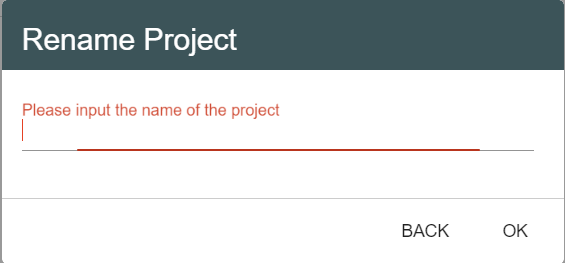
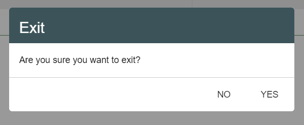
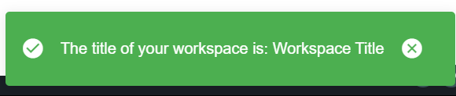
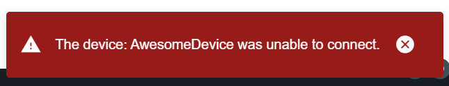

:orphan:

Dialogs and Notifications
===========================

|
|

In the *"workspace"* plugin you will find, additionally to the functions presented in the API sections, some functions design to create and display in the application some customized pop-ups, like dialogs, prompts and notifications.

Dialogs
*********
A dialog is a component that inform users about a specific task and may contain important information, require decisions, or involve multiple actions or inputs. It can usually be used to collect data from the user.

.. _showDialog:

showDialog
^^^^^^^^^^^
This is the main open-dialog function for the application. The parameters are:

.. list-table::

	* - *title*
	  - the title of the dialog window
	* - *component*
	  - the Vue component to display
	* - *options*
	  - additional specifications, like width
	* - *buttons*
	  - the array of buttons to display

The return is a *Promise* that will be resolved according to the user's response.

An example of use:

.. code-block:: javascript

	showDialog(AddProjectDialog,{width:512});

where *AddProjectDialog* is a Vue component, having a specific design and functionalities.

The result is the dialog that shows up when the user clicks on the **Project Library** button:

.. image:: images/project_dialog.png

|

showDeviceSettingsDialog
^^^^^^^^^^^^^^^^^^^^^^^^^^
Used to show the device settings dialog. 

The function has no parameters.

It's called if the user clicks on the currently connected device name, and opens a dialog where he can see its specifications.

.. !!!!!!!!!poza

|

.. _showConnectionSelectionDialog:

showConnectionSelectionDialog
^^^^^^^^^^^^^^^^^^^^^^^^^^^^^^^^

This function has no parameter.

It's called when the user clicks on the *‘Connect’* button and it shows a dialog containing a list with all the devices available for connection.

.. POZA!!!!!!!

|

Prompts
*********

A prompt is actually a dialog box that requires a user decision. A prompt box is often used if you want the user to input a value before entering a page, for example write a text or click on a button that will perform a certain action.

showPrompt
^^^^^^^^^^^
Shows a prompt that waits for the user input.

The function parameters are:

.. list-table::

	* - *title* 
	  - the title of the window box 
	* - *question*
	  - the question / additional details adressed to the user
	* - *original*
	  - the initialcontent of the input text area
	* - *action*
	  - the action to perform
	* - *values = {}*
	  - empty object; the parameter is not mandatory when you call this function, its purpose being to insert the value of a variable in a translated text 

For example, let's try to open a customized prompt when the user chooses to rename a project.

.. code-block:: javascript

	showPrompt('PROJECT_RENAME_PROJECT', 'PROJECT_NAME_PROMPT','', 'PROJECT_NEW_NAME');

|

showConfirmationPrompt
^^^^^^^^^^^^^^^^^^^^^^^^
Same as **showPrompt**, except that it waits for the user to confirm the question by pressing a **Yes/No** button and it doesn’t have an input text area.

The function parameters are:

.. list-table::

	* - *title*
	  - the title of the window prompt
	* - *question*
	  - the question that will be addressed to the user
	* - *values = {}*
	  - empty object; the parameter is not mandatory when you call this function, its purpose being to insert the value of a variable in a translated text 

For example, here's how we are using it to check if the user is sure that he wants to close the app.

.. code-block:: javascript

	showConfirmationPrompt('EXIT', 'WORKSPACE_TOOLBAR_EXIT_QUESTION');

|

Notifications
**************

The notifications are simple pop-ups that inform the user about unauthorized actions, required operations or system processes.

The possible types for a notification are: *info*, *success*, and *warning*, and each type has a distinct color.

.. _notification:

showNotification
^^^^^^^^^^^^^^^^^^

Obviously, this function's purpose is to send a notification to the user's application.

The function parameters are:

.. list-table::

	* - *text*
	  - the text of the notification
	* - *values={}*
	  - empty object; the parameter is not mandatory when you call this function, its purpose being to insert the value of a variable in a translated text 
	* - *type*
	  - info/succes/warning
	* - *timeout*
	  - the time frame in which the notification is displayed

We used the the translation function in order to translate the notification text according to the current language.

As an example of use, we can check if the user entered a valid name for the project he wants to create. If negative, we call the **showNotification** function.

.. code-block:: javascript

	showNotification ('PROJECT_NAME_PROMPT');

|

showError
^^^^^^^^^^

This function is almost identical to the **showNotification** function. 

The parameters are:

.. list-table::

	* - *text*
	  - the text of the notification
	* - *values={}*
	  - empty object; the parameter is not mandatory when you call this function, its purpose being to insert the value of a variable in a translated text 
	* - *timeout*
	  - the time frame in which the notification is displayed

The difference can be spotted in the code, where we use the type *error* as default.

For example, in the *“notebook”* plugin, we are sending an error if the user closes the upload image window without selecting a file:

.. code-block:: javascript

	showError('NOTEBOOK_SELECT_IMAGE_ERROR');

