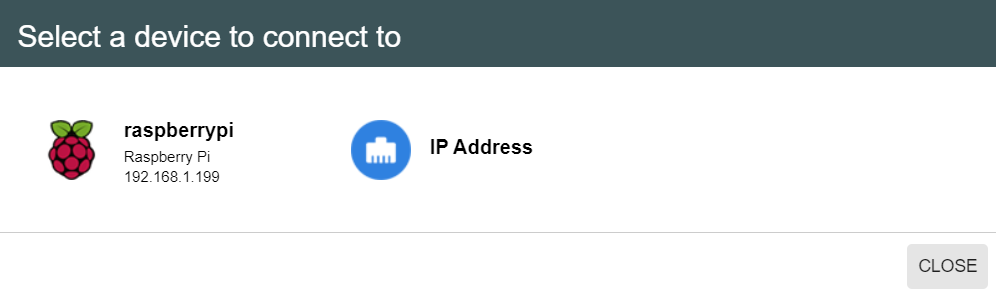

:orphan:

Dialogs and Notifications
===========================

|
|

In the *"workspace"* plugin you will find, additionally to the functions presented in the API sections, some functions designed to create and display some customized pop-ups, like dialogs, prompts and notifications.

Dialogs
*********
A dialog is a component that informs users about a specific task and may contain important informations, require decisions, or involve multiple actions or inputs. It can usually be used to collect data from the user.

.. _showDialog:

.. autofunction:: showDialog

.. image:: images/showDialog.png
	:align: center
	:width: 550px
	:height: 350px

|

.. autofunction:: showDeviceSettingsDialog

.. image:: images/deviceSettingsDialog.png
	:align: center
	:width: 470px
	:height: 380px

|

.. _showConnectionSelectionDialog:

.. autofunction:: showConnectionSelectionDialog

|

Prompts
*********

A prompt is actually a dialog box that requires a user decision. A prompt box is often used if you want the user to input a value before entering a page, for example write a text or click on a button that will perform a certain action.

|

.. autofunction:: showPrompt

.. image:: images/showPrompt.png
	:align: center
	:width: 500px
	:height: 270px

|

.. autofunction:: showConfirmationPrompt

.. image:: images/showConfirmationPrompt.png
	:align: center
	:width: 500px

|

Notifications
**************

The notifications are simple pop-ups that inform the user about unauthorized actions, required operations or system processes.

The possible types for a notification are: *info*, *success*, and *warning*, and each type has a distinct color.

.. _notification:

.. autofunction:: showNotification

.. image:: images/showNotification.png
	:align: center

|

.. autofunction:: showError

.. image:: images/showError.png
	:align: center
