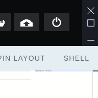
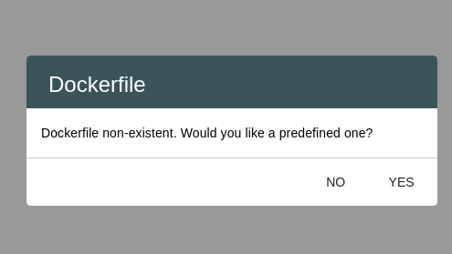
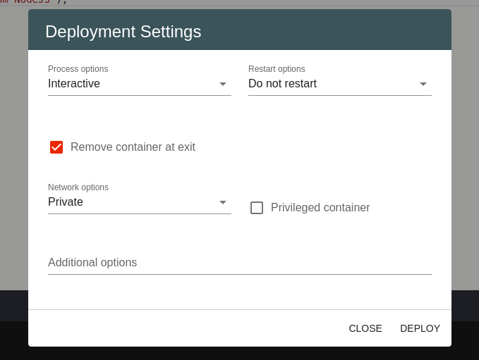
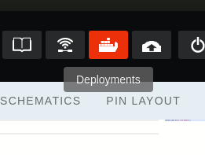
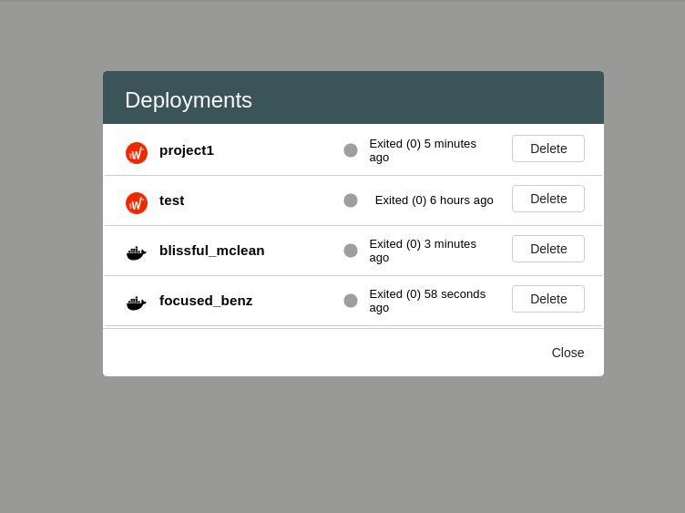

Docker
======================

Having in mind the diversity of languages, frameworks, architectures, and interfaces, the **Docker feature**  allows users to easily
develop and run their programs and projects. Its main benefit is to package applications in containers, allowing them to be portable 
to any system.

Steps to use the Docker feature
***************************************
This feature contains two main parts. Firstly, you can deploy projects using the **Deploy** button. 

After pressing it, the **Dockerfile** pop-up will appear.

This means that you do not have any dockerfile in the folder of your project. You now have the posibility to create a dockerfile through **Wyliodrin Studio**,
or to make one of your own. If you choose the first path, you will be able to customize your dockerfile in the **Deployment Settings** pop-up.

As you can see, there are already some default options set. However, you can always change them or add other options that you need in the **Additional Options** field.

By doing these actions, you succesfully deployed your project in a container. This container has the same name as your project and can be found in the **Deployments**
pop-up. This represents the second part of the **Docker** feature. By pressing the **Deployments** button you can manage both your containers created
in **Wyliodrin Studio**, and the ones created locally on your machine. 

After pressing this button you will be shown a list of all the containers.

In the list you will find two types of containers. The ones with the **Wyliodrin Studio** logo are the one created inside the application, whilst
the ones with the docker icon are created locally. You may also see in which state the container can be found in that particular moment, as well as delete or 
stop the containers.

