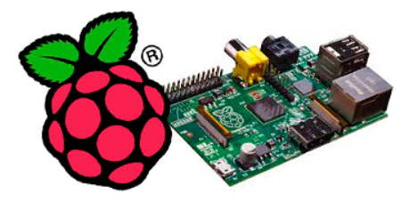
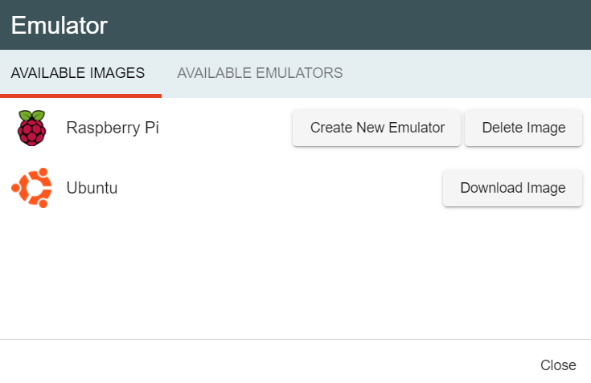
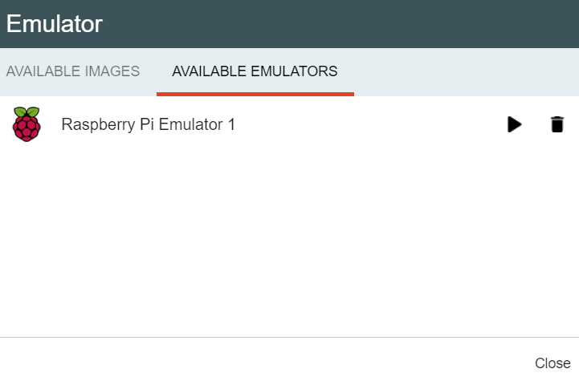

:orphan:

Emulators setup
==================

|

Install QEMU
**************

The first step into running an emulator on your computer within Wyliodrin Studio is to install the right version of the QEMU machine emulator for your computer. 

Install QEMU for `Linux <https://www.qemu.org/download/#linux>`_.

Install QEMU for `Windows <https://www.qemu.org/download/#windows>`_.

If your PC is running on Windows, you will have to add qemu in the PATH variable. In order to accomplish that, you will have to right click on *This PC*, select *Properties*, open the *Environment Variables* option, then edit the *PATH* variable. Here, you will have to add the absolute path to the folder where you chose to install qemu. The last step is to save the changes.

Install QEMU for `mac OS <https://www.qemu.org/download/#macos>`_.

Compile the QEMU `source code <https://www.qemu.org/download/#source>`_.

|

============================

Raspberry Pi Emulator
************************

Once you have the QEMU machine installed on your computer, you will be able to emulate a Raspberry Pi within Wyliodrin STUDIO. If you open the IDE, you will find the Emulator option between one of the items of the Menu.

If you don't have any emulator previously created on your computer, the first tab will be automatically displayed in the prompt that will pop up. Here, you will be able to see a list with all the supported types of emulators.

If you don't have any kernel image, you will have the option to download one previously configured by us. By clicking on the "Download image" button, a zip archive will be downloaded and unzipped in a special folder created on your computer. Once the download and decompression processes will be done, 2, new options will be available for the emulator.

As you can see in the picture shown above, you can either click on the **"Delete image"** button, that will permanently remove the kernel image from your computer, or on the **"Create new emulator"** button. 

This last option will pop up a prompt where you will be asked to input the name of your emulator. You will have to enter a valid name, having at least one character, that has not been already used for another emulator. This action will start the boot process for your emulator, by copying the kernel image into a folder specifically created for the new emulator. In a few minutes, the Raspberry Pi emulator will show up on your computer. 

By switching to the second tab of the Emulator prompt, you will see a list of all the available emulators that exist on your computer.

Here, for each available emulator, you will have 3 options:

* **Stop Emulator** - this button will kill the session for a chosen emulator, but your settings will be saved within the special folder.

* **Restart Emulator** - this button will be visible on each restart of Wyliodrin STUDIO or after each stop of an emulator. It will allow you to restart an emulator and to reload your changes and settings.

* **Delete Emulator** - this button will ask you if you really want to delete an emulator. By answering *yes*, the selected emulator will be permanently removed from your computer and you will lose all the saved data.

|

Connect to the emulator
^^^^^^^^^^^^^^^^^^^^^^^^^^

Once the emulator completely loaded, you will be asked to input the default username and password, which are: *pi* / *raspberry*. After that, you will have to start the ssh session by typing: *sudo systemctl ssh start*

.. image:: images/rpi_connect.png
	:align: center

After that, you will be able to find your emulator in the Connection Menu and to connect to it.

