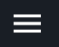
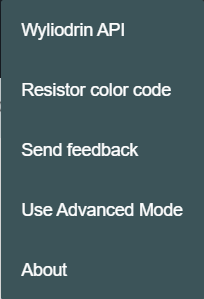
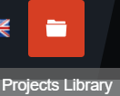
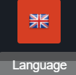
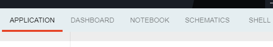
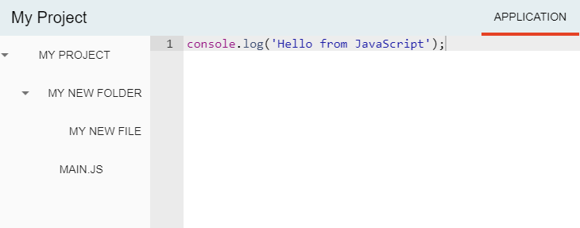
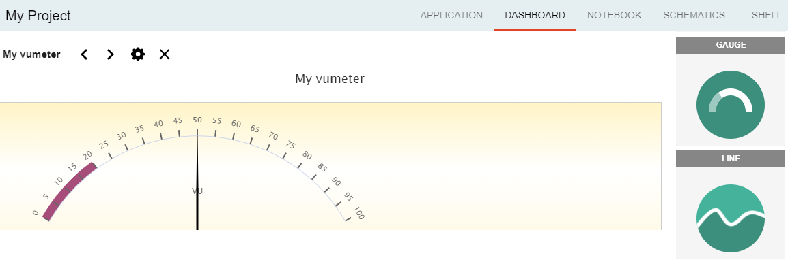
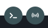

:orphan:

Extension methods
==================

|

Wyliodrin STUDIO enables customization, which means that you may add plugins to extend its features. Plugins may register different components, like buttons specifically designed for devices, workspace tabs, status buttons, toolbar buttons or menus.

Here is a list of plugins of this type, registered at this moment in Wyliodrin STUDIO:

Menu
*****
The menu button is included in the *Menu.vue* component, as a simple image button. 

If clicked, it opens a help menu including  some topics registered using the **registerMenuItem** function. The parameters of this function are:

.. list-table::
	:widths: 17 55 15 7

	* - Property title
	  - Description
	  - Required / Optional
	  - Default value
	* - *name*
	  - element label, registered as a string that will be translated as the menu item name
	  - required
	  - \-
	* - *priority*
	  - element priority in the list with all menu items; the item with the lowest priority is to the left
	  - required
	  - \-
	* - *component*
	  - the vue component attached to the current item
	  - required
	  - \-
	* - *options*
	  - additional options
	  - optional
	  - {}

An example of use, which registers the item *'New Menu Item'*, that will display a notification when opened:

.. code-block:: javascript

	registerMenuItem ('WORKSPACE_NEW_MENU_ITEM', 10, () => showNotification('You registered a new menu item!', 'success'));

|

The items currently registered in the menu are:

**Wyliodrin API**: opens a new window with the API documentation

**Resistor color code**: dialog with the color code of a resistor

**Send feedback**: dialog where you can write a feedback, having a printscreen attached

**Use Advanced/Simple Mode**: switch between the simple and advanced (more functionalities included) mode.

**About**: dialog with a short description of the application

|

Toolbar Buttons
****************
These buttons are located in the toolbar, on the top of the main window.
They are included in the *Toolbar.vue* file and saved into an array in the workspace store.

In order to create this type of buttons, we implemented the **registerToolbarButton** function:

.. list-table::
	:widths: 17 55 15 7

	* - Property title
	  - Description
	  - Required / Optional
	  - Default value
	* - *name*
	  - element label, registered as a string that will be translated
	  -	required
	  - \-
	* - *priority*
	  - element priority in the list with all toolbar buttons; the button with the lowest priority will be displayed to the left
	  - required
	  - \-
	* - *action*
	  - the actions that the buttton will perform on click
	  - required
	  - \-
	* - *iconURL*
	  - the image assigned
	  - optional
	  - ''
	* - *options*
	  - additional options
	  - optional 
	  - {}

For example, you can use the function like this:

.. code-block:: javascript

	registerToolbarButton('TOOLBAR_BUTTON', 10, () => showNotification('You created a toolbar button', 'success'), 'plugins/projects/data/img/icons/toolbar-button.svg');

we register a button having the translation key 'TOOLBAR_BUTTON', the priority 10, that on click will pop up a notification with the content: "You created a toolbar button". We need to specify the relative path to the image related to the button.

|

Language
**********
The language button is included in the *LanguageMenu.vue* component and its corresponding image, a flag, changes dynamically according to the selected language.

Here's a list with all the languages available at this moment: 

.. image:: images/all_languages.png
	:align: center 

When a language is selected from the list, the **setLanguage** function is called, which is using the `internationalization (i18n) <https://en.wikipedia.org/wiki/Internationalization_and_localization>`_ process, and the new language is updated, meaning that all the keys will be translated. More details about the translation function are discussed :ref:`here <translations>`.

|

Tabs
*****
The tabs are components of our application and accomplish various functions that help you handling your projects.

They are integrated with the **registerTab** function, having the following parameters:

.. list-table::
	:widths: 17 55 15 7

	* - Property title
	  - Description
	  - Required / Optional
	  - Default value
	* - *name*
	  - element label, registered as a string that will be translated
	  - required
	  - \-
	* - *priority*
	  - element priority in the list with all menu items: the tab with the lowest priority will be displayed to the left
	  - required
	  - \-
	* - *component*
	  - the vue component attached to the current tab
	  - required
	  - \-
	* - *options*
	  - additional options
	  - optional
	  - {}

For example, in order to register the ‘Notebook’ tab in the notebook plugin we called the function:

.. code-block:: javascript

	studio.workspace.registerTab('PROJECT_NOTEBOOK', 300, Notebook);

A list of the currently existing tabs:

|

**1. APPLICATION**

This tab opens the main file of your project. Here, you can write your code using one of the supported programming lanugages: *javascript*, *python*, *bash* or *visual* (using blocks). When a device is connected to Wyliodrin STUDIO, you can also use its *Run* button to run the code.

If you is using the *Advanced Mode*, you will be able to see in the left part of the window your project tree, which includes all the folder and files you created.

|

**2. DASHBOARD**

The purpose of this tab is to help you generate some graphical charts, that will receive signals from a connected board and will update their values according to the received data.

After selecting the type of the chart you want to create (*Extra*, *Gauge*, *Line*, *Slider*, *Speedometer*, *Switch*, *Thermometer*, or *Vu-meter*), a customized dialog will be opened and you will have the possiblity to choose the specifications for your graph.

|

**3. NOTEBOOK**

The Notebook tab, as its name indicates, offers you the possibility to write labs, exercises sheets and handouts directly in the project. It allows you to follow several steps so that you can better understand how to write and set up the application that you need to build.

It has 2 programming languages: *markdown* (including latex) and *python* (the code can be locally compiled if there is a board connected).

.. image:: images/notebook.png
	:align: center
	:width: 700px

|

**4. SCHEMATICS**

This tab can be used to upload your project schematics.

.. image:: images/schematics.png
	:align: center

**5. SHELL**

The shell tab is used to directly send commands to a connected board.

.. POZA

|

IThe tabs are registered in the *workspace* plugin. They can be accessed only if their *"enabled"* property is *true*, which means that you have to validate a certain condition: have an opened project or be connected to a device.

|

DeviceTool Buttons
********************

These buttons are visible only when a device is connected and they can be different according to the device type.

We added them in the *DeviceTools.vue* component, and this is how they look like:

POZA PI CONECTAT

They were previously registered using the **registerDeviceToolButton** function:

The parameters of this function are:

.. list-table::
	:widths: 17 55 15 7

	* - Property title
	  - Description
	  - Required / Optional
	  - Default value
	* - *deviceType*
	  - the type of the device driver type the button is for
	  - required
	  - \-
	* - *priority*
	  - element priority in the list with all device buttons; the button with the lowest priority will be displayed to the left
	  - required
	  - \-
	* - *action*
	  - the action that the buttton will perform on click
	  - required
	  - \-
	* - *iconURL*
	  - the image assigned
	  - optional
	  - ''
	* - *options*
	  - additional options and properties
	  - optional
	  - {}

An example on how to use this function to create this type of buttons can be:

.. code-block:: javascript

	registerDeviceToolButton('DEVICETOOL_BUTTON', 10, () => showNotification ('You created a device tool button!', 'success'));

Here, we registered a device tool button having the translation key 'DEVICETOOL_BUTTON', the priority 10, that on click will pop up a notification with the content: "You created a device tool button!".

|

Status Buttons
***************

The last component of the workspace is represented by the status buttons: **Console** and **MQTT**. They are created using the **registerStatusButton** function.

The parameters of this function are:

.. list-table::
	:widths: 17 55 15 7

	* - Property title
	  - Description
	  - Required / Optional
	  - Default value
	* - *name*
	  - element label, registered as a string that will be translated
	  - required
	  - \-
	* - *priority*
	  - element priority in the list with all status buttons; the button with the lowest priority is to the left.
	  - required
	  - \-
	* - *component*
	  - the vue component attached to the current item
	  - required
	  - \-
	* - *iconURL*
	  - the image assigned
	  - optional
	  - ''
	* - *options*
	  - additional options and properties
	  - optional
	  - {}

An overview on how the buttons were created:

.. code-block:: javascript

	studio.workspace.registerStatusButton ('CONSOLE', 1, Console, 'plugins/console/data/img/icons/terminal-icon.svg');

The **Console** button opens a console similar to the *shell*.

|

.. code-block:: javascript

	studio.workspace.registerStatusButton('MQTT', 1, MQTTServer, 'plugins/mqtt/data/img/icons/mqtt-icon.png');

The **MQTT** button opens an interface where you can choose the port where the *MQTT* server will be opened (the default port is 1883). MQTT is a publish-subscribe-based messaging protocol.

