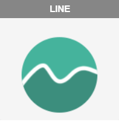
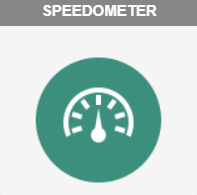
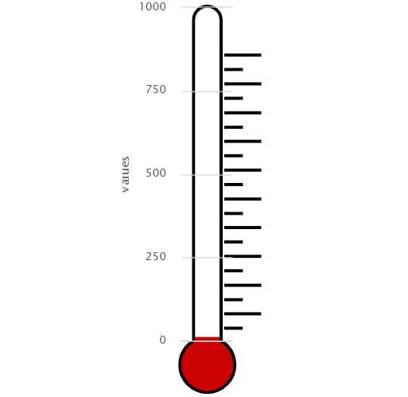
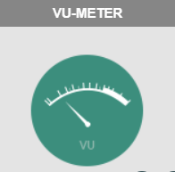
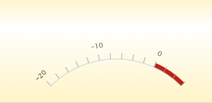
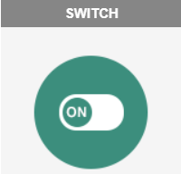
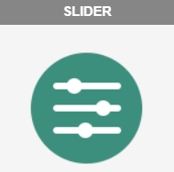
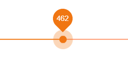

:orphan:

Extension methods
==================

|

Wyliodrin STUDIO enables customization, which means that you may add plugins to extend its features. Plugins may register different components, like buttons specifically designed for devices, workspace tabs, status buttons, toolbar buttons or menus.

Here is a list of plugins of this type, registered at this moment in Wyliodrin STUDIO:

Extension buttons
""""""""""""""""""

Menu
*****
The menu button is included in the *Menu.vue* component, as a simple image button. 

.. image:: images/menu.png
	:align: center

If clicked, it opens a help menu including  some topics registered using the **registerMenuItem** function. 

.. autofunction:: registerMenuItem

|

The items currently registered in the menu are:

**Wyliodrin API**: opens a new window with the API documentation

**Resistor color code**: dialog with the color code of a resistor

**Send feedback**: dialog where you can write a feedback, having a printscreen attached

**Use Advanced/Simple Mode**: switch between the simple and advanced (more functionalities included) mode.

**About**: dialog with a short description of the application

.. image:: images/menuitems.png
	:align: center

|

Toolbar Buttons
****************
These buttons are located in the toolbar, on the top of the main window.
They are included in the *Toolbar.vue* file and saved into an array in the workspace store.

In order to create this type of buttons, we implemented the **registerToolbarButton** function:

.. autofunction:: registerToolbarButton

we register a button having the translation key 'TOOLBAR_BUTTON', the priority 10, that on click will pop up a notification with the content: "You created a toolbar button". We need to specify the relative path to the image related to the button.

.. image:: images/registerToolbarButton.png
	:align: center

|

Language
**********
The language button is included in the *LanguageMenu.vue* component and its corresponding image, a flag, changes dynamically according to the selected language.

.. image:: images/language.png
	:align: center

Here's a list with all the languages available at this moment: 

.. image:: images/all_languages.png
	:align: center 

When a language is selected from the list, the **setLanguage** function is called, which is using the `internationalization (i18n) <https://en.wikipedia.org/wiki/Internationalization_and_localization>`_ process, and the new language is updated, meaning that all the keys will be translated. More details about the translation function are discussed :ref:`here <translations>`.

|

Tabs
*****
The tabs are components of our application and accomplish various functions that help you handling your projects.

They are integrated with the **registerTab** function:

.. autofunction:: registerTab

A list of the currently existing tabs:

.. image:: images/all_tabs.png
	:align: center

|

**1. APPLICATION**

This tab opens the main file of your project. Here, you can write your code using one of the supported programming lanugages: *javascript*, *python*, *bash* or *visual* (using blocks). When a device is connected to Wyliodrin STUDIO, you can also use its *Run* button to run the code.

If you is using the *Advanced Mode*, you will be able to see in the left part of the window your project tree, which includes all the folder and files you created.

.. image:: images/application.png
	:align: center

|

**2. DASHBOARD**

The purpose of this tab is to help you generate some graphical charts, that will receive signals from a connected board and will update their values according to the received data.

After selecting the type of the chart you want to create (*Extra*, *Gauge*, *Line*, *Slider*, *Speedometer*, *Switch*, *Thermometer*, or *Vu-meter*), a customized dialog will be opened and you will have the possiblity to choose the specifications for your graph.

.. image:: images/dashboard.png

|

**3. NOTEBOOK**

The Notebook tab, as its name indicates, offers you the possibility to write labs, exercises sheets and handouts directly in the project. It allows you to follow several steps so that you can better understand how to write and set up the application that you need to build.

It has 2 programming languages: *markdown* (including latex) and *python* (the code can be locally compiled if there is a board connected).

.. image:: images/notebook.png
	:align: center
	:width: 700px

|

**4. SCHEMATICS**

This tab can be used to upload your project schematics.

.. image:: images/schematics.png
	:align: center

**5. PIN LAYOUT**

The Pin Layout tab becomes enabled only when a board is connected. 

.. image:: images/pinlayout1.png
	:align: center

**6. SHELL**

The shell tab is used to directly send commands to a connected board.

.. image:: images/shell.png

|

The tabs are registered in the *workspace* plugin. They can be accessed only if their *"enabled"* property is *true*, which means that you have to validate a certain condition: have an opened project or be connected to a device.

|

DeviceTool Buttons
********************

These buttons are visible only when a device is connected and they can be different according to the device type.

We added them in the *DeviceTools.vue* component, and this is how they look like:

.. image:: images/devicetoolbuttons.png
	:align: center

They were previously registered using the **registerDeviceToolButton** function:

.. autofunction:: registerDeviceToolButton

Here, we registered a device tool button having the translation key 'DEVICETOOL_BUTTON', the priority 10, that on click will pop up a notification with the content: "You created a device tool button!".

|

Status Buttons
***************

The last component of the workspace is represented by the status buttons: **Console** and **MQTT**. They are created using the **registerStatusButton** function.

.. image:: images/registerStatusButton.png
	:align: center

.. autofunction:: registerStatusButton

The **Console** button opens a console similar to the *shell*, while the **MQTT** button opens an interface where you can choose the port where the *MQTT* server will be opened (the default port is 1883). MQTT is a publish-subscribe-based messaging protocol.

|

=======================

|

Dashboard Graphs
""""""""""""""""""

The purpose of the dashboard plugins is to create a collection of graphs that update their values according to the signals received from a connected device. 

The main plugin, *"dashboard"*, designs the Dashboard tab, which contains the list with the graphs that the user can draw, but it also serves as a store, where the states and values of the graphs are managed.

.. _registerGraph:

Inside the *index.js* file, we created the **registerGraph** function, that registers a graph component, with its data, options and settings, and constantly updates the *graphs* array in the *dashboard store*.The parameters of this function are:

.. list-table::
	:widths: 30 70

	* - Parameter title
	  - Description
	* - *name*
	  - graph label, translatable string
	* - *priority*
	  - graph priority in the list of all graphs, lower means higher
	* - *iconURL*
	  - the relative path to the image representing the graph
	* - *component*
	  - the Vue component to display when the uset chooses to draw a graph
	* - *options*
	  - additional options

Also here we create the functions **registerForSignal** and **emitSignal**, that will be called by the graphs, respectively by the connected device.

Here's a list of the graphs that are currently available in the application:

**1. Gauge**

.. image:: images/gaugesignal.png

.. image:: images/gaugegraph.png

**2. Line**

.. image:: images/linegraph.png
	:width: 350px
	:height: 220px

**3. Speedometer**

.. image:: images/speedometergraph.png
	:width: 300px
	:height: 230px

**4. Thermometer**

.. image:: images/thermometersignal.png

**5. Vumeter**

**6. Switch**

.. image:: images/switchgraph.png

**7. Slider**

**8. Extra**

.. image:: images/extrasignal.png

|

Each dashboard graph represents a new plugin, named *"dashboard.graph.name"*, where *name* represents the actual name of the graph.

The **views** folder contains 2 Vue components:

- *NameDialog.vue*, where we design the dialog opened when the user clicks on one graph from the list, allowing to customize the options and settings 

- *NameGraph.vue*, where we use the **vue2-highcharts** module to draw a graph, according to the data entered by the user in the dialog; more details about the available Highcharts and the parameters required for each chart can be found `here <https://www.highcharts.com/>`_.

The **index.js** file of each graph has the purpose to call the :ref:`registerGraph <registerGraph>` function from the main plugin dashboard, where the *component* parameter is the *NameGraph* Vue component, and the *options* parameter is represented by on object where we define the *setup* property. Here, we call a function that opens the *NameDialog* component and updates each graph's setup options according to the data inputted by the user.

Of course, in the ***package.json** file we have to specify that each dashboard.graph plugin consumes the main *dashboard* plugin.

|

=====================

|

Pin Layout plugin
""""""""""""""""""""

|

The **Pin Layout** tab becomes visible for a user only when a board is connected to Wyliodrin STUDIO, and it loads a "map" of the board and a legend of its pins. As we described in the :ref:`wyappBoard` section, when we register this type of device, we call the *registerPinLayout* function. This function is used to connect a type of device with the corresponding layout of the board pins.

The function is defined inside the *pinlayout* plugin, and its parameters are:

.. list-table::
	:widths: 30 70

	* - Parameter title
	  - Description
	* - *type*
	  - the type of the device
	* - *board*
	  - the name of the board
	* - *img*
	  - the relative path to the pin layout image

For example, if you want to register a Raspberry Pi board, inside the corresponding plugin you will call this function:

.. code-block:: javascript

	studio.pin_layout.registerPinLayout ('wyapp', 'raspberrypi', 'plugins/device.wyapp.raspberrypi/data/img/pins-raspberrypi.png');

|

Once a Raspberry Pi board is connected to Wyliodrin STUDIO, the Pin Layout tab will become available, and its content will be:

.. image:: images/pinlayout.png

The Vue component of this plugin, *PinLayout.vue*, is designed to change the pin layout image dynamically, according to the device type and board, and to become enabled/disabled, depending on the status of the device (CONNECTED / DISCONNECTED).

|

==========================

|

Console and Shell plugins
""""""""""""""""""""""""""

Both the Console and the Shell plugins depend on the *xterm* plugin. 

The "xterm" plugin uses the **xterm** module in order to register a terminal that will allow the user to interact with a connected board. 

The terminal has 2 implemented buttons: 

- *clear*: clear the content of the terminal
- *reset*: reboot the terminal

Both functions belong to the **xterm Terminal**, that is initialized when a device is connected. If there is no connected device, the terminal won't allow the user access and a replacement text will be displayed.

.. image:: images/noconsole.png
	:width: 270px
	:height: 200px

.. image:: images/noshell.png
	:width: 270px
	:height: 200px

|

The Xterm Terminal functioning is based on events.

The **title** of the terminal is applied when a device is connected and it changes dynamically, according to the type of the board. For example, if a Raspberry Pi board is connected, the title will be detected and automatically set to the terminal as *pi@raspberrypi*.

|

When the user starts typing commands in the terminal, the **write** function is called in order to save all the inputted data into a buffer, unique for each terminal. We also retain the cursor position, to write the characters successively.

|

Another event is to **resize** the terminal and it has to be done at each update. The resizing action supposes to set the geometry of the terminal (number of columns and rows).

|

Both *console* and *shell* plugins have the functionalities of the described Terminal, so they have to consume the *xterm* plugin. However, there is a certain difference between the 2 components:

The purpose of the **Console** is to display a terminal that allows you to see the output of the projects that you run in the Application tab.

.. image:: images/console.png

|

The **Shell** terminal represents the main component of the *Shell* tab, that allows you to send command directly to the board.

.. image:: images/shellTerm.png

|

====================

|

Settings Plugin
""""""""""""""""""

The *"settings"* plugin consumes our *filesystem* plugin in order to save special files that contain various settings for our plugins. The filesystem is implemented differently for each version of the Wyliodrin STUDIO application, but the main idea is to manage all the files and folders used inside the program.

In order to obtain the data that was written into a special settings file, we need to read the content of this file located inside a special settings folder. 

|

The main functions of the settings plugin are:

.. autofunction:: storeSettings

|

.. autofunction:: loadSettings

|

.. autofunction:: loadValue

|

.. autofunction:: storeValue