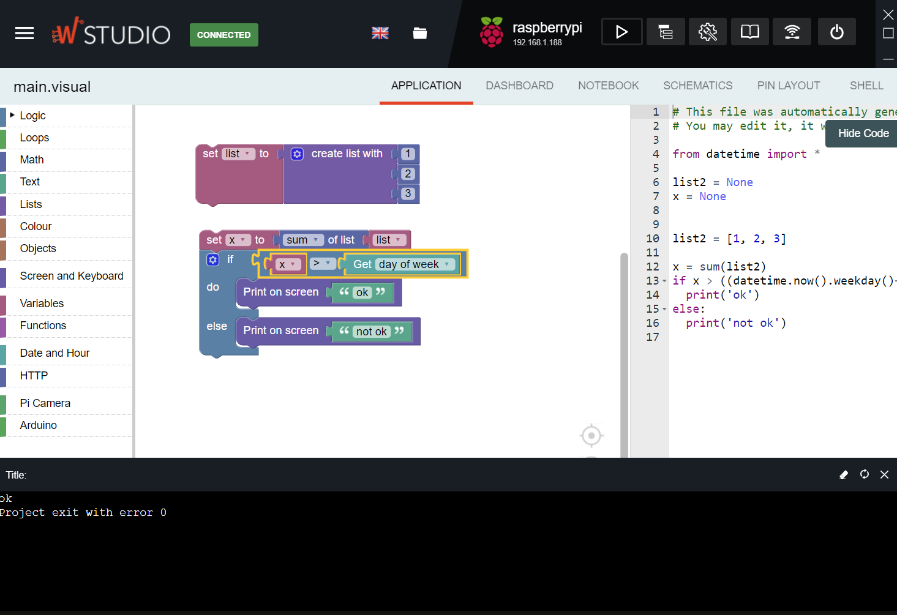
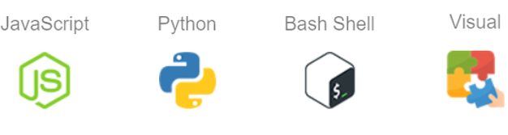

Wyliodrin Studio documentation
==============================

|
|

Wyliodrin STUDIO is an educational platform for software and hardware development for IoT and Embedded Linux systems. 

The application has been built as an extendable framework. The main architecture is a collection of plugins that add functionality. This approach has been chosen as different devices have very different ways of connecting and interacting with the computer and/or the browser.

The plugin system allows Wyliodrin STUDIO to be very flexible and extendable. Adding features such as supported devices or languages and event very different new functionalities is a matter of writing a new plugin.

|

The purpose of Wyliodrion STUDIO is to help its users deploy industrial IoT application, gain IoT knowledge and offer customized results in the same domain, by providing them a series of professional solutions:

* Connect to devices using TCP/IP or serial port
* Develop software and firmware for IoT in several programming languages
* Shell access to the device
* Import and export Wyliodrin STUDIO projects
* Visual dashboard for displaying sensor data
* Display the hardware schematics
* Manage packages for Python and Javascript
* Task manager for managing the device
* Network connection manager for the device (Ethernet and WiFi)
* Interactive electronics documentation (resistor color code)
* Example projects and firmware
* Wyliodrin API documentation in C/C++, Python and Javascript

For the moment, the devices supported by the platform are:

* Raspberry Pi
* UDOO Neo
* BeagleBone Black

.. image:: images/devices.png
	:align: center

Also, the recognized programming languages at the time are:

* Javascript
* Python
* Shell Script (bash)
* Visual Programming (translates to Python)

|

.. toctree::
   :maxdepth: 3
   
   start
   boards
   architecture
   extension
   api
   plugin
   translations
   dialogs_notifications
   simulator_raspberrypi

.. Indices and tables
.. ==================

.. * :ref:`genindex`
.. * :ref:`modindex`
.. * :ref:`search`
