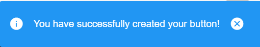
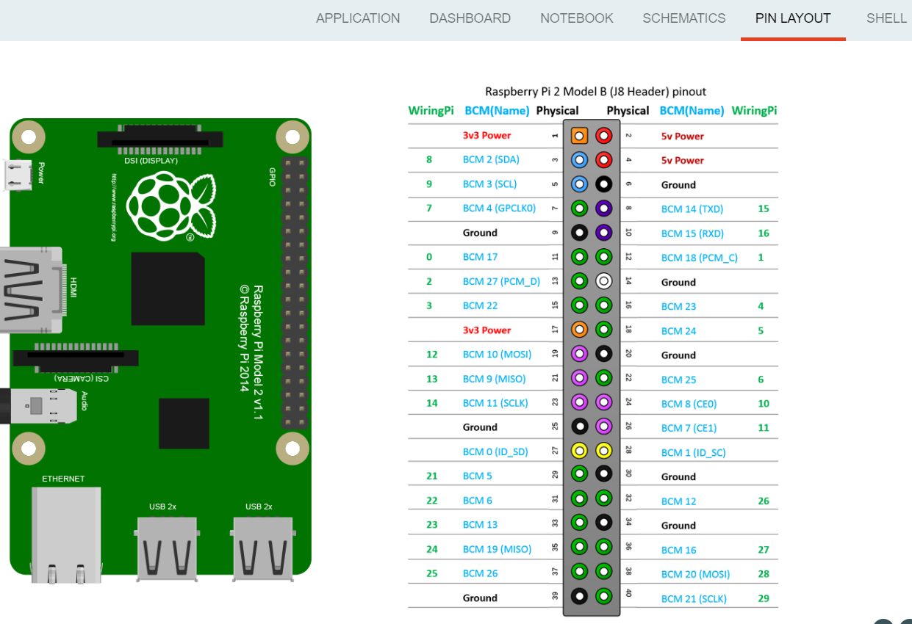
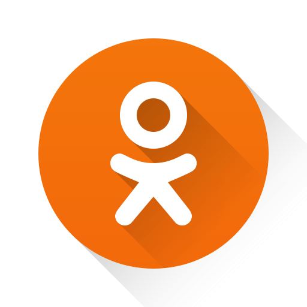

:orphan:

How to write a plugin
=========================

|

.. _simple:

Simple plugin
*****************
In this section, we will try to create a new plugin, called **"button.example"**, that will add a toolbar button which will show a notification when is clicked.

The purpose of this tutorial is to help you to better understand the idea of plugin, the steps that you need to follow, the structure and behavior of each component file, as they were explained in the :ref:`Architecture chapter <plugin>`.

The first step will be to create the *button.example* folder inside the *plugins* directory. 

Each plugin contains 2 special folders:

The first one the **data** folder, that has to be copied exactly as it is created in the *build* folder of the program. This **data** directory will include all the images and icons needed to represent the components of a plugin, but also other aditionals files needed in order to make your plugin run properly. 

|

The second special component is the **translations** folder, which will contain the translatable key strings from your plugin, and also their translations.

More details about how the translation function works can be found :ref:`here <translations>`.

Only to exemplify the content of this folder, we'll create the **messages-en.json** (english language) and **messages-fr.json** (french language).

In our *index.js* file, you can notice that we used 2 strings having the following format: *'PLUGIN_STRING_TO_TRANSLATE'*, more precisely: *'EXAMPLE_BUTTON_NAME'* and *'EXAMPLE_BUTTON_NOTIFICATION_TEXT'*. It means that this key-strings have to be included in both our translation files.

As you can see in the :ref:`Translations <translations>` chapter, the value that the key string will receive has to be an object with 2 properties: *message* (the actual translation), *description* (a short definition of the string to translate).

By the end, your **messages-ln.json** (ln = language) files should look like this:

.. code-block:: json

	{
		"EXAMPLE_BUTTTON_NAME": {
			"message": "Notify",
			"description": "This button pops-up a notification."
		},
		"EXAMPLE_BUTTON_NOTIFICATION_TEXT": {
			"messages": "You have successfully created your button!",
			"description": "This is the notification text when the user clicks the button."
		}
	}

|

.. code-block:: json

	{
		"EXAMPLE_BUTTTON_NAME": {
			"message": "Notifier",
			"description": "This button pops-up a notification."
		},
		"EXAMPLE_BUTTON_NOTIFICATION_TEXT": {
			"messages": "Vous avez créé le bouton avec succès",
			"description": "This is the notification text when the user clicks the button."
		}
	}

|

Then, we'll add the **package.json** file. As mentioned before, the content of this type of file has to be an object with the following properties:

.. list-table::
	:widths: 17 55 15 7

	* - Property title
	  - Description
	  - Required / Optional
	  - Default value
	* - *name*
	  - the name of the plugin (“button.example”)
	  - required
	  - \-
	* - *version*
	  - 0.0.1
	  - required
	  - "0.0.1"
	* - *main*
	  - the main file of the plugin, that will be “index.js”
	  - required
	  - "index.js"
	* - *plugin*
	  - an object where we specify the characteristics of the plugin
	  - required
	  - \-

The properties of the *"plugin"* component are:

.. list-table::
	:widths: 17 55 15 7

	* - Property title
	  - Description
	  - Required / Optional
	  - Default value
	* - *consumes*
	  - we specify from which other plugins our plugin uses exported functions (required *"workspace"*)
	  - required
	  - ["workspace"]
	* - *provides*
	  - we specify if our plugin functions will be exported (*"example_button"*)
	  - optional
	  - []
	* - *target*
	  - for which version of the program the plugin should be working: **browser** or **electron**
	  - required
	  - \-

Finally, the content of our package.json will be:

.. code-block:: json

	{
		"name": "button.example",
		"version": "0.0.1",
		"main": "index.js",
		"private": false,
		"plugin": {
			"consumes": ["workspace"],
			"provides": ["button_example"],
			"target" : ["browser", "electron"]
		}
	}

|

The next step is to create the main file, called **index.js**. 

If you already read :ref:`this section <plugin>`, you probably noticed that in the **index.js** file we should've imported first the **.vue** files from the **views** folder. In this plugin tutorial, we only register a simple button, which means that we don't need a **.vue** file to design a specific Vue component., so the **views** folder will also be missing.

Therefore, we'll only need to initiate a **studio** variable to *null* and to create an empty object called **button example**.

After that, we have to export a *setup* function, its parameters being:

.. list-table::
	:widths: 17 55 15 7

	* - Property title
	  - Description
	  - Required / Optional
	  - Default value
	* - *options* 
	  - additional options
	  - optional
	  - null
	* - *imports* 
	  - all the functions that our plugin collects from the plugins that it consumes (in our case, the functions exported by *workspace*)
	  - required
	  - \-
	* - *register*
	  - a function that will register the plugin object
	  - required
	  - \-

Inside this function, the **studio** variable instantiated before will receive the **imports** value.

After that, we need to register our button, so we'll call the worskpace function **registerToolbarButton**, which will have the following parameters:

.. list-table::
	:widths: 30 70

	* - *'EXAMPLE_BUTTON_NAME'*
	  - the name of our button, a key string that will be translated
	* - *20* 
	  - integer number representing the priority of our button in the list of all toolbar buttons
	* - *() => studio.workspace.showNotification*
	  - the action that will be performed when the user clicks on this button
	* - *'plugins/button.example/data/img/button.png'* 
	  - the relative path to the image that will represent our button

The **showNotification** function is also called from the workspace and its parameters are:

.. list-table::
	:widths: 30 70

	* - *'EXAMPLE_BUTTON_NOTIFICATION_TEXT'* 
	  - the key string that will be translated and will represent the text of our notification
	* - *'success'* 
	  - the notification type

|

By the end, our **index.js** file should look like this:

.. code-block:: javascript

	let studio = null;
	let button_example = {};

	export function setup(options, imports, register)
	{
		studio = imports;
		studio.workspace.registerToolbarButton ('EXAMPLE_BUTTON_NAME', 20,
			() => studio.workspace.showNotification ('EXAMPLE_BUTTON_NOTIFICATION_TEXT', 'success'),
			'plugins/button.example/data/img/button.png');

		register(null, {
			button_example: button_example;
		})
	}

As you noticed above, when we registered the image corresponding to our button, we specified its relative path, which includes some additional folders in our *button.example* plugin. 

|

To test if you successfully created your first plugin, you have to rebuild the program using the 2 commands for electron **npx webpack**, then **npm start**. 

.. image:: images/examplebutton.png
	:align: center

|

|

How to create a device plugin
*********************************

This type of plugin allows you to add and use a new device to the Wyliodrin STUDIO platform, so you need to properly register its functions and characteristics.

|

The **data** folder should contain all the images that you need to represent the device (the icon displayed in the list of available devices) and its features (for example the DeviceToolButtons), but also, if needed, the additional files that you'll use to make your device work and run projects.

|

The **views** folder has to include every Vue component relied to your device, for example: disconnect, device settings or device manager dialogs.

|

The **package.json** file will have the classic format, but if it's necessary the "plugin" object will require an additional property, called **"optional"**, where you will specify if the plugin consumes the *console* or the *mqtt* plugins.

|

The **translations** folder will also have the usual structure, including the *messages-ln.json* files with the unique keys that you used in your device plugin, for each language of the program.

|

The main file **index.js** is the most important for this type of plugin, as its purpose is to include all the functions and characteristics that will make your device work. 

You have to begin with importing all the Vue components that you created, and also all the modules and packages that your device requires in order to work properly.

After that, you will create the functions needed to search and update your device type:

	**loadDevice**: uses a specialized module to scan the operating system of the client and search for your type of device.

	**listDevice**: will try to return a list of the available devices, if they can be found.

	**updateDevices**: simply call the workspace :ref:`updateDevices <updateDevices>` function.

	**searchDevices**: checks systematically the list with all the available devices found, trying to find those having the name or the description fitting your type of device;

	adds a new object to the *devices* array, with the relevant properties: unique *id*, *name*, *description*, *address*, *priority*, *icon*, type of *board*, type of *connection*, and others additional properties depending on the type of the device.

Inside the *setup* function, you have to create the object you will register and export for your plugin, its properties being the functions that will help the user manage your device on the Wyliodrin Studio platform:

	**defaultIcon**: correlates a default icon to a device that doesn't have any particular image already attached

	**registerForUpdade**: registers to receive updates for a device

	**getConnections**: returns the connections array for every unique device id

	**connect**: connects the device to Wyliodrin Studio; if there is no connection previously created for the current unique id of the device, it will create a data transport path conforming with the type of your device;

	after that, according to the current status,  you will bring up to date your device, using the *updateDevices* function and you will set up its functioning characteristics.

		The device statuses are:

.. list-table::

	* - DISCONNECTED
	  - the device is offline
	* - CONNECTING
	  - trying to connect
	* - SYNCHRONIZING
	  - trying to synchronize with the device
	* - CONNECTED
	  - the device is online
	* - ISSUE
	  - there is some issue, the system is partially functional
	* - ERROR
	  - there is an error with the system

**disconnect**: opens a dialog where the user chooses the way he wants to disconnect the device; the methods of disconnection are:

		* *StandBy* - 
		* *Disconnect* - 
		* *Turn-Off* - 

After creating the new device object, you have to register it using the workspace function :ref:`registerDeviceDriver <registerDevice>` and generate the specific buttons for your type of device, using also an workspace function: :ref:`registerDeviceToolButton <registerDeviceToolButton>`. 

Each device should have a **Run** button, that will run the code written by the user in the current project, and a **Stop** button, to interrupt the current project from running, but you can always add others particular buttons, specialized to execute yor own functions. These buttons should include 2 properties, *visible* and *enabled*, whose values become *true* only if there is a device connected.

Also, if your device interacts with the *console* or the *mqtt* server, you will have to create some specific functions that will establish the data transfer protocol.

|

.. _wyappBoard:

How to add a wyapp board
***************************

If you're trying to add a new board plugin, our *"device.wyapp.raspberrypi"*, *"device.wyapp.beagleboneblack"* and *"device.wyapp.udooneo"* plugins may serve as a support for you.

In the **index.js** file, inside the *setup* function, you need to create an event, so when the board is *'ready'*, you call the **registerPinLayout** function from our *"pinlayout"* plugin. The purpose of this function is to register the pins of your board in the **Pin Layout** tab, using the appropriate images that you saved in the *data* folder of our plugin.

For example, if we are connected to a Raspberry Pi, the content of the Pin Layout tab will be: 

The next step is to create an object having your new board name, with the next functions:

	**iconURL()** => the image corresponding to your board

	**found(device)** => if a device was found, you can modify some of its properties

	**update(device)** => update a device, modify some of its properties

	**run(project)** => modify the project before run

|

The final step is to register your board and, if it's necessary, the blocks that you'll use, from the *"editor_visual"* plugin.

For example, if you want to register a *raspberry pi* board, you should use this function:

.. code-block:: javascript

	registerBoard ('raspberrypi', raspberrypi);

|

How to write an editor plugin
********************************

The purpose of an editor plugin is to create a code editor, which is correlated to our *"projects"* plugin.

The name of the editor plugins should be **projects.editor.**, followed by the name of the editor. 

First, you need to create the **views** folder, where your **.vue** files will be included. Inside the *EditorAce.vue* file, you will have to create an **editor** tag, which is actually an imported module, installed as *'vue2-ace-editor'*. The editor will be dynamically updated according to the changes that are made in the code. An *initEditor* function is required here at initialization, to import the modes, themes and snippets supported by your editor. The mode will be updated according to the programming language, marked by the type/extension of the file.

|

How to write a language plugin
********************************

The purpose of this type of plugins is to register a new programming language that will be supported by the Wyliodrin Studio IDE.

For example, we'll try to add a new programming language, called "MyAwesomeLanguage", whit the *".aws"* extension:

As you can notice, the name of this type of plugins should begin with *"language."*, which will be followed by the actual name of the programming language that you want to register, which means that you will have to create a new folder, **"language.myawesomelanguage"**.

As any other plugin, it's  required to have a *package.json* file, having the classic format. It's necessary to mention that this type of plugin **consumes** both *"workspace"* and *"projects"* plugins, and their **target** are both *"electron"* and *"browser"*.

So, the content of your package.json should look like that:

.. code-block:: json

	{
		"name": "language.myawesomelanguage",
	    "version": "0.0.1",
	    "main": "index.js",
	    "private": true,
	    "plugin": {
	        "consumes": ["workspace","projects"],
	        "provides": [],
	        "target": ["electron", "browser"]
	    }
	}

The language plugin doesn't have any Vue component, so we don't have to create the **views** folder, but we need the **data** folder to save a characteristic image for the programming language. Let's pick as example for our *language.myawesomelanguage* plugin, an icon that we will save in the **data/img** folder:

Inside the main file, **index.js**, we obviously need to initialize the *studio* variable to null, and inside the *setup* function it will receive all the imported functions from the "workspace" and "projects" plugin.

The next step is to create the **awesome** object, containing the options of our programming language:

.. code-block:: javascript

	let studio = null;

	export default function setup (options, imports, register)
	{
		studio = imports;
		
		let awsome = {
			async createProject(name){
				await studio.projects.newFile(name,'/main.aws','print ("Hello from Awesome")');			
			},
			getDefaultFileName() {
				return '/main.aws';
			},
			getDefaultRunFileName() {
				return '/main.aws';
			},
			getMakefile(project, filename) {
				if (filename[0] === '/') 
					filename = filename.substring (1);

				return 'run:\n\tawesome main.aws';
			},
		};

The next step is to register the new programming language, using the function :ref:`registerLanguage <registerLanguage>`:

.. code-block:: javascript

	studio.projects.registerLanguage('awesome', 'awesome', 'plugins/language.myawesomelanguage/data/img/awesome.png', awesome);

where the last parameter represents the *awesome* object we created before.

|

How to add a language addon plugin
*************************************

This type of plugin modifies the language plugin for certain devices. For instant, we are using it for visual and rpk. To design your own language addon, you will have to create a new plugin folder, called *"language.visual."*, followed by the type of the device you want the language addon for.

For example, let's say that you want to create an addon for your *Awesome* device and you need to create a new plugin, called **language.visual.awesome**

|

The first step is to create a new folder, **visual**, where you will add .................. *.js* files.

You will also have to create a *toolbox.xml* file, where you will include the actual design of the blocks you want to be available for your device.

|

The **index.js** file will first import the *xml* module and the *toolbox.xml* file, the second one as a string, using the *raw-loader* module. More details about this webpack loader can be found `here <https://github.com/webpack-contrib/raw-loader>`_.

.. code-block:: javascript

	import xml from 'xml-js';
	import toolboxStr from 'raw-loader!./visual/toolbox.xml';

Then, you will import the code and the blocks from the *.js* files included in the *visual* folder.

.. code-block:: javascript

	let blocks = require ('./visual/definitions_for_awesome.js');
	let code = require ('./visual/code_for_awesome.js');

The *setup* function will register the changes you made for your device, using the projects function :ref:`registerLanguageAddon <registerLanguageAddon>`. 

.. code-block:: javascript
	
	let studio = null;
	export function setup (options, imports, register)
	{
		studio = imports;

		studio.projects.registerLanguageAddon ('visual', 'awesome', 'awesome', {
			getDefaultRunFileName ()
			{
				return '/main.visual.js';
			},

			sourceLanguage ()
			{
				return 'myawesomelanguage';
			}
		});

		let toolbox = xml.xml2js (toolboxStr);
		studio.editor_visual.registerBlocksDefinitions ('awesome', blocks, code, toolbox, {type: 'awesome', board: 'awesome'});

		register (null, {});
	}

As you can notice, the final step is to parse the toolbox string imported before and then to register the blocks using the **registerBlocksDefinitions** function from the *projects.editor.visual* plugin. 

The parameters of this function are:

.. list-table::
	:widths: 17 55 15 7

	* - Property title
	  - Description
	  - Required / Optional
	  - Default value
	* - *id*
	  - the id of the device
	  - required
	  - \-
	* - *blocks*
	  - the blockly visual blocks
	  - required
	  - \-
	* - *code*
	  - the blockly code
	  - required
	  - \-
	* - *toolbox*
	  - the parsed toolbox string
	  - required
	  - \-
	* - *options*
	  - additional options, an object where you can specify the device type and the board
	  - optional
	  - {}

Of course, you also need to have a **package.json** file, where you should mention that your language addon plugin also consumes "editor_visual", because it's using the *registerBlockDefinitions* function.

.. code-block:: json

	{
	    "name": "language.visual.awesome",
	    "version": "0.0.1",
	    "main": "index.js",
	    "private": true,
	    "plugin": {
	        "consumes": ["workspace","projects","editor_visual"],
	        "provides": [],
	        "target": ["electron"]
	    }
	}
