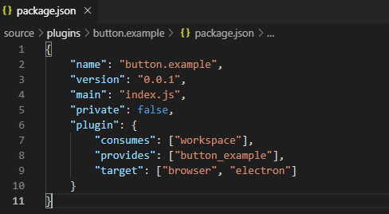
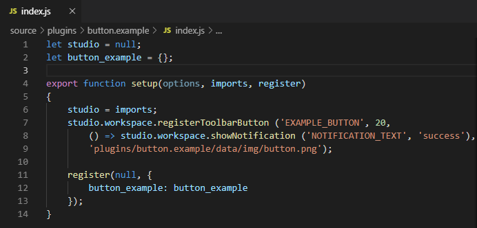
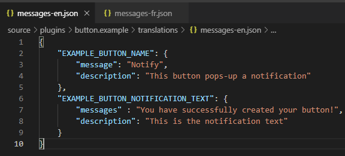
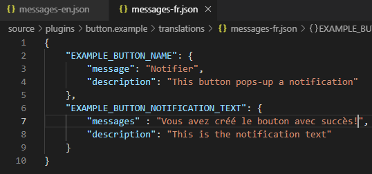

:orphan:

How to write a plugin
=========================

|

Getting started
*****************
In this section, we will try to create a new plugin, called **"button.example"**, that will add a toolbar button which will show a notification when is clicked.

The purpose of this tutorial is to help you to better understand the idea of plugin, the steps that you need to follow, the structure and behavior of each component file, as they were explained in the :ref:`Architecture chapter <plugin>`.

The first step will be to create the **button.example** folder inside the *plugins* directory. Then, we'll add the *package.json* file.

As mentioned before, the content of this type of file has to be an object with the following properties:

.. list-table::

	* - **"name"**
	  - the name of the plugin (“button.example”)
	* - **"version"**
	  - "0.0.1"
	* - **"main"**
	  - the main file of the plugin, that will be “index.js”
	* - **"plugin"**
	  - an object where we specify the characteristics of the plugin

The properties of the *"plugin"* component are:

.. list-table::

	* - **"consumes"**
	  - we specify from which other plugins our plugin uses exported functions(required *"workspace"*)
	* - **"provides"**
	  - we specify if our plugin functions will be exported(*"example_button"*)
	* - **"target"**
	  - for which version of the program the plugin should be working: **browser** or **electron**

Finally, the content of our package.json will be:

|

The second step is to create the main file, called **index.js**. 

If you already read :ref:`this section <plugin>`, you probably noticed that in the **index.js** file we should've imported first the **.vue** files from the **views** folder. In this plugin tutorial, we only register a simple button, which means that we don't need a **.vue** file to design a specific Vue component.

Therefore, we'll only need to initiate a **studio** variable to *null* and to create an empty object called **button example**.

After that, we have to *export* a **setup** function, its parameters being:

.. list-table::

	* - *options* 
	  - additional options
	* - *imports* 
	  - all the functions that the plugin collects from the plugins that it consumes (in our case, the functions exported by *workspace*)
	* - *register*
	  - a function that will register the plugin object

Inside this function, the **studio** variable instantiated before will receive the **imports** value.

After that, we need to register our button, so we'll call the worskpace function **registerToolbarButton**, which has the following parameters:

.. list-table::

	* - **'EXAMPLE_BUTTON'**
	  - the name of our button, a key string that will be translated
	* - **20** 
	  - integer number representing the priority of our button in the list of all toolbar buttons
	* - **() => studio.workspace.showNotification**
	  - the action that will be performed when the user clicks on this button
	* - **plugins/button.example/data/img/button.png'** 
	  - the relative path to the image that will represent our button

The **showNotification** function is also called from the workspace and its parameters are:

.. list-table::

	* - **'NOTIFICATION_TEXT'** 
	  - the key string that will be translated and will represent the text of our notification
	* - **'success'** 
	  - the notification type

|

By the end, our **index.js** file should look like this:

As you noticed above, when we registered the image corresponding to our button, we specified its relative path, which includes some additional folders in our *button.example* plugin. So, inside the *button.example* directory we have to create the **data** folder, which will include another folder, called **img**. Here, we'll copy our image, its name being **button.png**.

|

The last component missing from our plugin is the **translations** folder. More details about how the translation function works can be found :ref:`here <translations>`.

Only to exemplify the content of this folder, we'll create the **messages-en.json** (english language) and **messages-fr.json** (french language).

In our *index.js* file, you can notice that we used 2 strings having the following format: **'PLUGIN_STRING_TO_TRANSLATE'**, more precisely: *'EXAMPLE_BUTTON_NAME'* and *'EXAMPLE_BUTTON_NOTIFICATION_TEXT'*. It means that this key-strings have to be included in both our translation files.

As you can see in the :ref:`Translations <translations>` chapter, the value that the key string will receive has to be an object with 2 properties: *message* (the actual translation), *description* (a short definition of the string to translate).

By the and, your **messages-ln.json** (ln = language) files should look like this:

|

To test if you successfully created your first plugin, you have to rebuild the program using the 2 commands for electron **npx webpack**, then **npm start**. 

POZA DIN APLICATIE

|

Write a device driver plugin
******************************

Now that you manage to create your own, simple plugin, the next step wold be to understand how the device driver plugins are made.

An additional component will be a **"visual"** folder, which will include 4 **'.js'** files: *code_picamera*, *code_pyfirmata*, *definitions_picamera* and *definitions_pyfirmata*. The purpose of these files is to import the blocks necessary to run the code on your board.

|

If you're trying to add a new board plugin, our *"device.wyapp.raspberrypi"*, *"device.wyapp.beagleboneblack"* and *"device.wyapp.udooneo"* plugins may serve as a support for you.

In the **index.js** file, you will have to import the 4 files mentioned above from the **visual** folder.

After that, in the *setup* function, you nedd to create an event, so when the board is *'ready'*, you call the **registerPinLayout** function from our *"pinlayout"* plugin. The purpose of this function is to register the pins of your board in the **Pin Layout** tab, using the appropriate images that you saved in the *data* folder of our plugin.

For example, if we are connected to a Raspberry Pi, the contect of the Pin Layout tab will be: 

.. POZA

The next step is to create an object having your new board name, with the next functions:

	**iconURL()** => the image corresponding to your board

	**found(device)** => if a device was found, you can modify some of its properties

	**update(device)** => update a device, modify some of its properties

	**run(project)** => modify the project before run

|

The final step is to register your board and, if it's necessary, the blocks that you'll use, from the *"editor_visual"* plugin:

For example, if you want to register a *raspberry pi* board, you should use this function:

.. code-block:: javascript

	registerBoard ('raspberrypi', raspberrypi);

|

How to write an editor plugin
********************************
Since you have all cleared about how to create a plugin ang the main files it should consist of, we can pass to the next tutorial, which includes the making of an editor plugin. The purpose of this type of plugins is to create a text editor, which is correlated to our *"projects"* plugin.

The name of the editor plugins should be **projects.editor.**, followed by the name of the editor. To make things more clear, we'll use the *projects.editor.ace* plugin as an example.

First, we need to create the **views** folder, where our **.vue** file will be included. The editor has to be integrated like this:

.. image::images/editor.png

The **editor** tag is actually a module imported, installed as *'vue2-ace-editor'*.

As you can notice, we are modeling the **source** variable (*v-model="source"*), to update the editor according to che canges that are made. 

The option **@init="initEditor"** calls the *initEditor* function at initialization. This function is defined in *methods* and its purpose is to make a require on some modes, themes and snippets supported by the text editor:

The option **:lang="sourceLanguage"** updates the mode according to the programming language, while **:options="editorOptions"** applies some customized options.

In the **script** part, we nedd to add a *watch* property on the **filename** variable:

The purpose is to change the mode, meaning to update the *sourceLanguage* variable, according to che type/extension of the file.

We are also watching the changes that occur on the **source** variable and when it's updated, we are saving the file that was edited with our editor.

The content of the **index.js** file is classic. At first, we import the Vue component created before:

.. code-block:: javascript

	import Ace from './views/AceEditor.vue';

After that, inside the *setup* function, we register our new editor using the workspace function :ref:`registerEditor <editor>`:

.. code-block:: javascript

	studio.projects.registerEditor('EDITOR_ACE',['py','js','json','d','c','h','sh'], Ace);

|

How to write a language plugin
********************************

The purpose of this type of plugins is to register a new programming language that will be supported by the Wyliodrin Studio IDE.

As an example, we'll use our **language.python** plugin.

As you can notice, the name of this type of plugins should begin with *"language."*, which will be followed by the actual name of the programming language that you want to register.

As any other plugin, it's also required to have a *package.json* file, having the classic format. It's necessary to mention that this type of plugin **consumes** both *"workspace"* and *"projects"* plugins, and their **target** are *"electron"* and *"browser"*.

The language plugin doesn't have any Vue component, so we don't have to create the **views** folder, but we need the **data** folder to save a characteristic image for the programming language. For example, for our *language.python* plugin, the image in the **data/img** folder is:

.. image:: images/language.python.png
	:align: center
	:width: 70px
	:height: 70px

Inside the main file, **index.js**, we  obviously need to initialize the *studio* variable to null, and insinde the *setup* function it will receive all the imported functions from the "workspace" and "projects" plugin.

The next step is to create the **python** object, its properties being:

.. list-table::

	* - **createProject**
	  - function where we use the *newFile* function from the *projects* plugin to create a **main.py** file
	* - **getDefaultFileName**
	  - function where we return the *'/main.py'* file
	* - **getDefaultRunFileName**
	  - function where we return the *'/main.py'* file
	* - **getMakefile**
	  - function that returns the content of the makefile for the chosen language ( here, *return 'run:\n\tpython main.py';*)

The next step is to register the new programming language, using the function :ref:`registerLanguage <registerLanguage>`:

.. code-block:: javascript

	registerLanguage('python', 'Python', 'plugins/language.python/data/img/python.png', python);