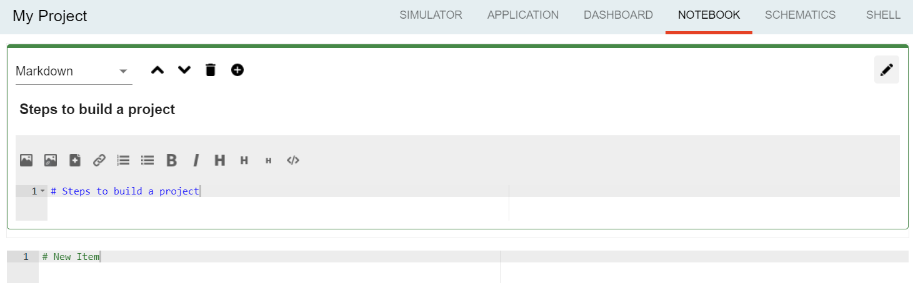

:orphan:

Projects
===========
|
|

The **"projects"** plugin is the second most important component in our application. Same as *"workspace"*, it has its own store, where we register the applications the user creates, in order to manage properly his activity.

|

_isPathValid(basePath, filePath)
""""""""""""""""""""""""""""""""""""""
* *"basePath"* = the folder containing the project files
* *"filePath"* = the full path

It's an internal function, that we use in order to validate a path.
It checks if **basePath** can be found in **filePath** and returns *null* otherwise. The function **path.normalize()** is used here to transform a relative path into the absolute path.

getLanguage(languageID)
""""""""""""""""""""""""""""
Returns a language object with the following properties: id, title, icons, addons and options.

registerLanguage(id, title, icon, options)
"""""""""""""""""""""""""""""""""""""""""""""""""
Updates the **“languages”** array with an object referring to a programming language. The accepted languages are: *javascript*, *python*, *bash* and *visual*. 

.. image:: images/registerLanguage.png
	:align: center

For example, to add the python language, we had to register it in the *index.js* file of the *"language.python"* plugin:

.. code-block:: javascript

	studio.projects.registerLanguage('python', 'Python', 'plugins/language.python/data/img/python.png', python);

where **“python”**, the last parameter, is an object that contains the specifications of the python programming language, mentioned above.

registerLanguageAddon(language, board, type, addon = {})
"""""""""""""""""""""""""""""""""""""""""""""""""""""""""""""
Applies an addon for an existing programming language. In this case, an addon refers to a specific feature that we set up for a board.

* *"language"* - language id
* *"board"* - addon board
* *"type"* - addon type
* *"options"* - addon options

_runLanguageFunction (fn, project, ...params)
""""""""""""""""""""""""""""""""""""""""""""""""""
RIt's an internal function, that runs any function provided by a programming language.

For example, we used it in the *"projects*" folder, to create a function that creates new projects: 

.. code-block:: javascript

	this._runLanguageFunction ('createProject', project);

registerEditor(name, languages, component, options = {})
"""""""""""""""""""""""""""""""""""""""""""""""""""""""""""""
Registers a new text editor, using the ebeddable code editor Ace, in order to add a syntax highlighting textbox.

* *"name"* - the name/id of the editor
* *"language"* - the editor language
* *"component"* - the component to display

For example, in the *“projects.editor.ace”* we created an Ace Editor which supports some file types:

.. code-block:: javascript

	studio.projects.registerEditor('EDITOR_ACE',['py','js','json','d','c','h','sh'], Ace);

createEmptyProject(name, language)
"""""""""""""""""""""""""""""""""""""""
Creates a new, empty project, having the name and language specified by the user.

We called this function in the *“projects”* plugin (*AddProjectDialog.vue* component):

.. code-block:: javascript

	project = await this.studio.projects.createEmptyProject(this.projectName,this.languageID)

where **projectName** and **languageID** can be modified depending on the user’s preferences.

deleteProject(project)
"""""""""""""""""""""""""""

* *"project"* = name of the project the user wants to delete

This function deletes all the files related to the project chosen by the user. It is called inside the **ProjectLibrary.vue** component, when the user clicks on the "Delete" button. After removing all the files, we dispatch to the projects store the *currentProject* and the *currentFile* as *null*.

renameProject(project, newName)
"""""""""""""""""""""""""""""""""""""
* *"project"* = name of the project the user wants to rename
* *"newName"* = the new name that the user wants to assign to the current project

Replaces the name of a chosen project with the **“newName”** value, that is selected in the input text area. The function is also called inside the **ProjectLibrary.vue** component, when the user clicks on the *"Rename"* button.

cloneProject(project, newName)
""""""""""""""""""""""""""""""""""""
* *"project"* = name of the project the user wants to rename
* *"newName"* = the name that the user wants to assign to the cloned project

Creates a duplicate of the selected project and it names it with the **“newName”** value chosen by the user. Same as **renameProject**, the function is called inside the **ProjectLibrary.vue** component, when the user clicks on the *"Clone"* button.

importProject(project, extension)
"""""""""""""""""""""""""""""""""""""""
* *"project"* = project object
* *"extension"* = archive extension (.zip/.tar/.wylioapp)

Loads a new project tree from the user’s computer. The archive extension can be *“.zip”*, *“.tar”* (in this case the files will be extracted), or *‘.wylioapp”* (we are creating recursively the project folder).

recursiveCreating(necesarry) 
"""""""""""""""""""""""""""""""""""""
Generates the project tree structure with paths and names. **“necessary”** is an object representing the details about every file within the project

	* *necesarry.item* - file item
	* *necessary.item.isdir* - is or not directory
	* *necessary.item.children* - only if it's a directory
	* *necessary.item.name* - name
	* *necessary.item.content* - file content only if it's a file

We are using it in the *importProject* function mentioned before (*.wylioapp* extension)

.. code-block:: javascript

	for (let item of projectImport.tree) {
        await this.recursiveCreating({
            item: item,
            prev: item,
            folder: workspacePath
        });

exportProject(project,savePath)
"""""""""""""""""""""""""""""""""""""
* *"project"* = the current project chosen
* *"savePath"* = the destination path selected by the user

Exports a project archive (*.zip* extension format) to the chose path in user’s computer.

newFolder(project, name)
"""""""""""""""""""""""""""""""
Creates a new folder in the current project.

* “project” = the current project object”
* “name” = path to where to create the new folder. 

This option is valid only in the *Advanced Mode*.

newFile(project, name, data = '')
""""""""""""""""""""""""""""""""""""""""
Creates a new file in the current project.

* “project” = the current project object”,
* “name” = path to where to create the new folder
* “data” =  data that will be written in the new file

This option is valid only in the *Advanced Mode*.

renameObject(project, newName, pathTo)
"""""""""""""""""""""""""""""""""""""""""""
Renames the selected file/ folder.

* “project” = the project object
* “newName” = the new name of the project, chosen by the user
* "pathTo" = path to existing file/folder

deleteFile(project, pathTo)
"""""""""""""""""""""""""""""""""
Deletes the current file of a project tree.

* “project” = the project object
* “pathTo” = the path to the selected file

deleteFolder(project, pathTo)
""""""""""""""""""""""""""""""""""""
Deletes the selected folder of a project tree.

* “project” = the project object
* “pathTo” = the path to the folder

loadProjects()
""""""""""""""""""""""
Loads the existing projects.

We are using this function after each change that was made on the **Projects library**: *renameProject*, *cloneProject*, *importProject*.

selectCurrentProject(project)
""""""""""""""""""""""""""""""""""
* *"project"* = the project where the user decides to select

Selects a project when the user clicks on it and it loads the data in the Application tab.

loadPreviousSelectedCurrentProject()
""""""""""""""""""""""""""""""""""""""""""""
Loads the last selected project from the local files. 

We are using this function in the **Application.vue** component pf the *"projects"* plugin, in the *created()* section, because we want to load the last selected project at each new running of the application.

saveFile(project, name, buffer)
""""""""""""""""""""""""""""""""""""""
Saves an edited file.

* “project” = the project object
* “name” = the path to the file
* “buffer” = the file buffer that will actually be saved

loadFile(project, name)
"""""""""""""""""""""""""""""
Loads a file. It returns a string that represents the file content.

* “project” = the project object
* “name” = the full file name, including its path

changeFile(name)
""""""""""""""""""""""
Changes the current file in the store.

* “name”=path to the file

saveSpecialFile(project, name, content)
""""""""""""""""""""""""""""""""""""""""""""""
Saves a special settings file.

* “project” = the current project object
* “name” = the special file name
* “context” = the contect that will be saved in the special file

For example, in order to save our notes written in the *“Notebook”* tab (*“notebook”* plugin), notes that are different for each project, we called this function. It created a special **“notebook.json”** file, where we keep the explicit data notes for every project.

.. code-block:: javascript

	this.studio.projects.saveSpecialFile(this.currentProject,'notebook.json', JSON.stringify (this.elements));

where **this.elements** represents an array of notes that we create in the Notebook.

loadSpecialFile(project, name)
""""""""""""""""""""""""""""""""""""
Loads a special settings file.

* “project” = the current project object
* name” = the special file name

Given the example above, we call this function each time we are changing the project, so the Notebook can load its specific content for each project apart. 

.. code-block:: javascript

	data = await this.studio.projects.loadSpecialFile(this.currentProject,'notebook.json');

recursiveGeneration(project, file)
"""""""""""""""""""""""""""""""""""""""""
Recursively generates a deep object with all the contents of a project and returns an object, which is the root of the folder with all its contents.

* "project" = Project object
* "file" = File object

generateStructure(project, isRoot=true)
""""""""""""""""""""""""""""""""""""""""""""""
* *"project"*  the current project object 

Generates the tree structure of a project and it returns the tree structure with items of type **recursiveGeneration** (explained above).

getCurrentProject()
""""""""""""""""""""""""""""
Returns a project object loaded from the store.

For example, we used this function to check if there is a project open, so we know if we should enable the “Notebook” tab.

.. code-block:: javascript

	studio.workspace.registerTab('PROJECT_NOTEBOOK', 300, Notebook, {
        enabled () {
            return !!studio.projects.getCurrentProject ();
        }
    });

getDefaultFileName(project)
"""""""""""""""""""""""""""""""""
Returns the default file name for a specified project, using the **_runLanguageFunction**.

For example, in the *“language.python”* plugin, we create a *“python”* object, to which we associate the default file name *‘/main.py’*.

.. code-block:: javascript

	getDefaultFileName() {
            return '/main.py';
        }

getDefaultRunFileName(project)
"""""""""""""""""""""""""""""""""""""""
Returns the default run file name for a specified project, using the **_runLanguageFunction**.

Same as the **getDefaultFileName** function above,, in the *“language.python”* plugin, inside the *“python”* object we created, we associate the default run file name *‘/main.py’*.

.. code-block:: javascript

	getDefaultRunFileName() {
            return '/main.py';
        }

getMakefile(project, filename)
""""""""""""""""""""""""""""""""""""""
Similar to the 2 functions above, returns the makefile for the **“filename”** of a **“project”**.

An example of use of this function can also be found in the *“language.python”* plugin:

.. code-block:: javascript

	getMakefile(project, filename) {
            if (filename[0] === '/') filename = filename.substring (1);
            // TODO add filename
            return 'run:\n\tpython main.py';
        }

languageSpecificOption (project, option)
"""""""""""""""""""""""""""""""""""""""""""""""
Gets the default run file name of a language.

We used it in the *“projects.editor.visual”* plugin, to obtain the source language of a specific project.

.. code-block:: javascript

	sourceLanguage = this.studio.projects.languageSpecificOption (this.currentProject, 'sourceLanguage');

getFileCode(project, pathTo)
""""""""""""""""""""""""""""""""""
Gets the file code of a project.

* *"project"* = the project object
* *"pathTo"* = the path to the file

To obtain the full path of the file where the code is located, we join the project folder and the **pathTo**, then we use the **_isPathVaild** function to validate this actual path. 
To obtain the file code we are interested in, we use the 
**readFile(actualPath)** function.

getCurrentFileCode()
"""""""""""""""""""""""""""
Get the current file code.

This function returns an object representing the current project with its tree structure. We use the **getFromStore** function to obtain the *currentProject* and *currentFile* and, similar to the function above, we validate the path and call  the **readFile** function.

