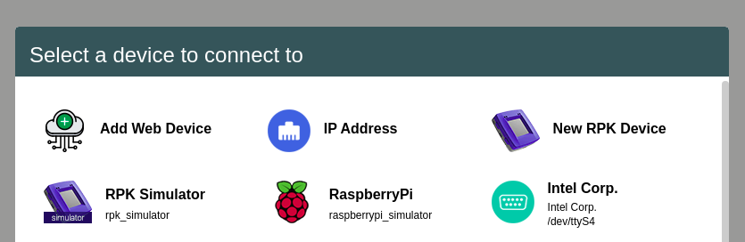
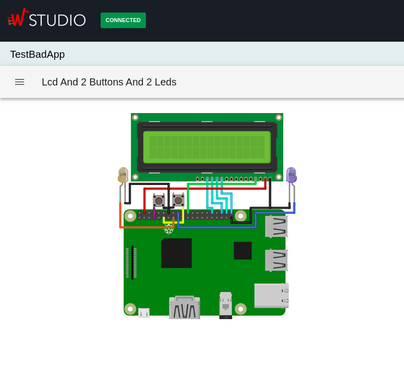
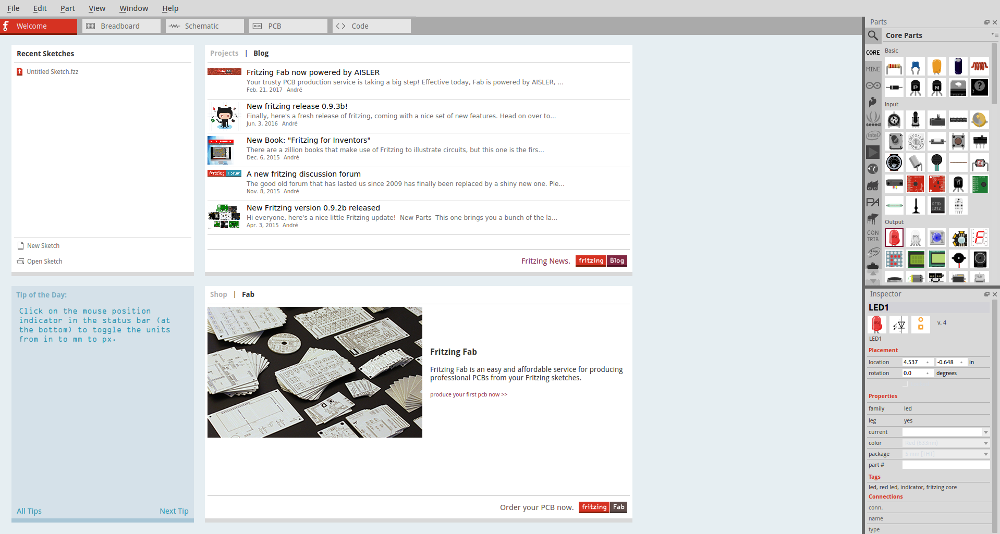

RaspberryPi Simulator
======================

The **RaspberryPi Simulator** is a plugin used for the simulation of simple circuits using a RaspberriPi. It can simulate series circuits
made of leds, buttons and LCDs. The code to be runned on the RaspberryPi is written in the **Application** tab, and the only supported language is
**NodeJS**. So, the basic 2 components of this plugin is the **project** and the **schema** of the circuit.

|

Steps to use the RaspberryPi Simulator
***************************************

You can use the RaspberryPi Simulator by following the next steps.

1. Connection
##############

If you are connected to another device, disconnect from it. After that, press the **CONNECT** button in the headbar, and afterwards choose the
**"RaspberryPi"** that runs on the board **raspberrypi_simulator**. This simulates a connection to a phisical board.

2. RaspberryPi Simulator tab
#############################

After you connect to the RaspberryPi Simulator board, a new tab will appear on the right in the tab list, named **RASPBERRY PI**. This 
tab has a structure of three components:

.. image:: images/raspberrypi_simulator/raspberryPiSimulatorTab.png
	:align: center

1. The button to open the list of examples 
	It is located right under the tab list.
	After you press the button, a list of examples will be opened on the left side.
	At the top of the list will be a button **LOAD SCHEMA** used to load your own schema. We will discuss about that later.

.. image:: images/raspberrypi_simulator/examplesList.png
	:align: center

2. The circuit image 
	It is located on the left side of the window.
	The image is interactive, meaning that the leds can turn on, the buttons can pe pressed, and so on.

3. The table of connections 
	It is located on the right side of the window.
	Here you will see a simplified structure of the connections, so you can see which pins are connected in order to know how to use the components.

.. image:: images/raspberrypi_simulator/tableExample.png
	:align: center

3. Load a project and run it
#############################

After you got accostumed to the **RaspberryPi Simulator tab**, you can load a project written in **NodeJS**. There are only 2 libraries available at 
the moment, in order to control the GPIO pins on the RaspberryPi and the LCDs.

Afterwards, you can just press the **RUN** button and the code will start to execute. Also, the console remains active in the RaspberryPi Simulator tab, 
so you can see the evolution of your code while interacting with the schema loaded.

|

Load your own schema
*********************

The RaspberryPi Simulator plugin runs on schemas created with **Fritzing**. A schema has 2 components:
	- the image of the circuit, saved in a **SVG** format
	- the **netlist** with the connections, saved in a **XML** format

In order to create your own schema, you can follow the next steps.

1. Download and open Fritzing
##############################

You can access the Fritzing download page by clicking `here <https://http://fritzing.org/download/>`_. After you download the application, 
open it. You will see the below window.

2. Add components
##################

After you open the app, you have to go to the **Breadboard tab**. From this tab you will export the files required for the schema, meaning the **SVG** image 
and the **XML** netlist. On the right-top side you will see a window with components. From there you can search for the desired the components. The available 
components that are recognized by the simulator are:
	- **RaspberryPi 3**
	- **Pushbutton**
	- **LED**
	- **LCD 16x2**

In order to place a component with just have to drag and drop it on the main panel from the Breadboard tab.

.. image:: images/raspberrypi_simulator/fritzingComponentList.png
	:align: center

3. Make connections
####################

After you've placed all the required components, you have to acces the **Schematic tab**. There you will see all components and you can make the connections 
between them. After the connections are done, you have to go back on the **Breadboard tab** and make the phisical connections again. There will be dotted lines
that correspond to the connections from the Schematic tab. Also, you can edited the components from the window on the right-bottom. For example, you can change
the color of the led, or the color of the wire.

.. image:: images/raspberrypi_simulator/fritzingSchematicTab.png
	:align: center

.. image:: images/raspberrypi_simulator/fritzingBreadboardTab.png
	:align: center

4. Export from Fritzing
########################

**Attention! In order to export the files from the schema created, you have to be on the Breadboard tab.**

To export the required files for the schema, you have to follow 2 steps:
	- export the SVG file: **File -> Export -> as Image -> SVG...**
	- export the XML netlist: **File -> Export -> XML Netlist...**

You have to save the files on your computer in an easy accesible location, because you will need the afterwards.

5. Import to Wyliodrin STUDIO
##############################

To import the files just created with Fritzing, you have to follow the next steps:
	- access the **RASPBERRY PI** tab
	- click on the button to open the list with examples
	- press **LOAD SCHEMA**, and a pop-up will appear on your screen
	- give a name to your schema if you want
	- press **ADD SVG FILE** and choose your just-created SVG file
	- press **ADD XML NETLIST** and choose your just-created XML netlist
	- press **UPLOAD**

.. image:: images/raspberrypi_simulator/pop-up.png
	:align: center

If all the steps are followed correctly, your schema should appear on the main view, along side with the table of connected components.

.. image:: images/raspberrypi_simulator/schemaJustCreated.png
	:align: center

|

Libraries for RaspberryPi Simulator
************************************

In the RaspberryPi Simulator you can almost fully use two main libraries: **onoff.GPIO** and **LCD**. The usage of these libraries is 
the same as the usage on phisical boards. The only difference is that not every function is available. Bellow you can see a list of 
available function for the 2 libraries. To see more of the usage for these libraries you can access one of the links bellow:
	- `onoff  <https://www.npmjs.com/package/onoff>`_
	- `LCD  <https://www.npmjs.com/package/lcd>`_

onoff.GPIO:
	- **create(pin, state)** -> creates an object from which you can control the GPIO pins on the RaspberryPi. The *state* parameter is a string and it indicates the type for the pin **input/output**
	- **readSync()** -> return the value readed by the pin **1/0**
	- **writeSync(value)** -> outputs on the GPIO pin the selected value **1/0**
	- **direction()** -> return the state of the pin
	- **setDirection(state)** -> change the state of the pin
	- **activeLow()** -> return the state of the *activeLow* property of the pin
	- **setActiveLow(value)** -> change the activeLow property on the pin

LCD:
	- **create(object)** -> it creates an object in order to interact with the LCD. The object contains 4 properties: rs, e, data, cols, rows
	- **print(string)** -> print the given string on the screen starting from the cursor current position
	- **clear()** -> clears the LCD screen
	- **home()** -> sets the cursor on the cell **0x0** on the LCD
	- **setCursor(row, col)** -> sets the cursor on the *row* line and *col* column
	- **scrollDisplayLeft()** -> scrolls the display one position tp the left
	- **scrollDisplayRight()** -> scrolls the display one position tp the right
	- **close()** -> close the connection with the LCD and free the assigned pins

**Attention! LCD library only supports the 16x2 LCD!**

|

Code examples
**************

Bellow are 2 code examples on how to use the **onoff.GPIO** library and the **LCD** library.

|

onoff.GPIO example
###################

The schematic associated to this code should have a led connected to *GPIO4* pin on the RaspberryPi 
and to the *GND* pin, and a button connected to the *GPIO22* pin and to the *3V* pin.

This program will wait 2 seconds, will turn the led on, the will wait another 2 seconds and 
will turn it off. Afterwards, it will remain in the *while* loop while the button is not pressed.

.. code-block:: javascript

	var Gpio = require("onoff").Gpio;

	var led = new Gpio(4, "out");
	var button = new Gpio(22, "in");

	sleep(2000);
	led.writeSync(1);
	sleep(2000);
	led.writeSync(0);

	while(button.readSync() === 0) {
		sleep(1000);
	}

	console.log("onoff.Gpio tutorial finished!");

|

LCD example
############

The schematic associated to this code should have a LCD connected as it follows: 
	- VSS connected to the *GND* pin
	- VDD connected to the *5V* pin
	- RS connected to the *GPIO25* pin
	- E connected to the *GPIO2* pin
	- DB4 connected to the *GPIO23* pin
	- DB5 connected to the *GPIO17* pin
	- DB6 connected to the *GPIO18* pin
	- DB7 connected to the *GPIO22* pin

This program will write the "Hello world, from the LCD!" string on the LCD. Because it won't fit, we will scroll 
the display to the left for 10 times, and the we will clear the display. At the end, we close the 
connection to the LCD.

.. code-block:: javascript

	var LCD = require("lcd");
	var lcd = new LCD({rs: 25, e: 2, data: [23, 17, 18, 22], cols: 16, rows: 2})

	lcd.print("Hello World, from the LCD!");

	sleep(2000);

	for (var i = 0; i < 10; i ++) {
	    sleep(1000);
		lcd.scrollDisplayLeft();
	}

	sleep(1000);
	lcd.clear();

	lcd.close();

	console.log("LCD tutorial finished!");