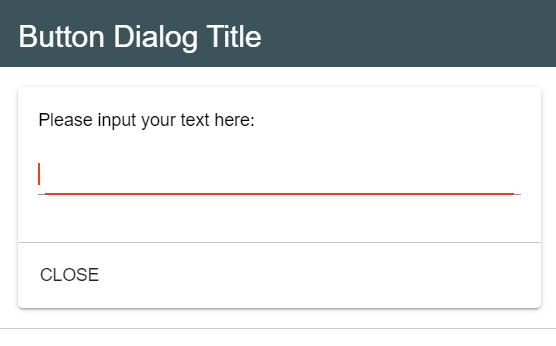

:orphan:
Workspace
=========

|
“Workspace” is the main plugin in our application. It exports the 
*"workspace”* object, containing a series of functions that we use in every other plugin.

|

1. registerTab(name, priority, component, options={}) 
"""""""""""""""""""""""""""""""""""""""""""""""""""""
	Registers an item that may be disposed in the application
For example, in order to register the ‘Notebook’ tab, in the index.js file corresponding to the notebook plugin, we called the function:

.. code-block:: javascript

	studio.workspace.registerTab('PROJECT_NOTEBOOK', 300, Notebook)

.. image:: images/registerTab.png
	:align: center

2. registerComponent(component)
"""""""""""""""""""""""""""""""
Registers a new vue-component. As an example, we used it to register our Xterm component, in the *"xterm"* plugin

.. code-block:: javascript

	imports.workspace.registerComponent (Xterm);

3. registerMenuItem(name, priority, component, options={})
""""""""""""""""""""""""""""""""""""""""""""""""""""""""""
Registers an element in the app’s menu.
For example, we registered the item *“Wyliodrin API”* in the *"documentation"* plugin (index.js file)

.. code-block:: javascript

	studio.workspace.registerMenuItem ('WYLIODRIN_API', 10, () => documentation.openDocumentation());

where the component corresponds to a predefined function, that opens the actual documentation

.. image:: images/registerMenuItem.png
	:align: center

4. registerToolbarButton (name, priority, action, iconURL, options = {})
""""""""""""""""""""""""""""""""""""""""""""""""""""""""""""""""""""""""
Registers a new button in the app’s toolbar.
For example, in order to register the **Project Library** button, we had to register it in the *index.js* file of the *“projects”* plugin:

.. code-block:: javascript

	studio.workspace.registerToolbarButton('PROJECT_LIBRARY', 10, () => studio.workspace.showDialog(ProjectsLibrary, {
	        width: 1000
	    }), 'plugins/projects/data/img/icons/projects-icon.svg');

The component corresponds to a function that opens a new window where the users can manage their projects.

.. image:: images/registerToolbarButton.png
	:align: center

5. registerDeviceToolButton (deviceType, name, priority, action, iconURL, options = {}) 
"""""""""""""""""""""""""""""""""""""""""""""""""""""""""""""""""""""""""""""""""""""""
Registers a new button used to manage the functioning of a device. These buttons show up only when a device is connected and they are specific for every device.

For example, when a raspberry pi is connected, we have the following buttons: **Run**, **Stop**, **TaskManager**, **PackageManager**, **NetworkManager**, which we registered in the *“device.wyapp”* plugin.

.. image:: images/registerDeviceToolButton.png
	:align: center

.. !!imagine butoane cu pi conectat

6. registerStatusButton (name, priority, component, iconURL, options = {})
""""""""""""""""""""""""""""""""""""""""""""""""""""""""""""""""""""""""""
Registers the buttons used to open the *console* or the *mqtt* server, like:

.. code-block:: javascript

	studio.workspace.registerStatusButton('CONSOLE', 1, Console, 'plugins/console/data/img/icons/terminal-icon.svg');

.. image:: images/registerStatusButton.png
	:align: center
	:width: 80px
	:height: 50px

7. registerStore (namespace, store)
"""""""""""""""""""""""""""""""""""
Registers the vuex store for a plugin
For example, to register the store for the *“projects”* plugin, we had to call this function:

.. code-block:: javascript

	studio.workspace.registerStore('projects', projectStore);
where project store had to be imported:

.. code-block:: javascript

	import projectStore from './store';

8. getFromStore (namespace, variable)
"""""""""""""""""""""""""""""""""""""
Gets the value of the *“variable”* from the *“namespace”* store.
We called this function to get the current project from our *“projects”* store:

.. code-block:: javascript

	let project = studio.workspace.getFromStore('projects', 'currentProject');

9. dispatchToStore(namespace, action, data)
"""""""""""""""""""""""""""""""""""""""""""
Sends data to the "namespace" store promptly. Similar as before, we used it in the *"projects"* plugin, to register the current project into the store:

.. code-block:: javascript

	this.studio.workspace.dispatchToStore('projects', 'currentProject', null);

10. showNotification(text, values = {}, type = 'info', timeout = 6000)
"""""""""""""""""""""""""""""""""""""""""""""""""""""""""""""""""""""""
Displays a customized vuetify notification. The type can be “info”, “success” or “warning” and the text and values can be translated using the **$t** function.
For example, in the *"projects"* plugin, we check if the user entered a valid name for the project he wants to create. If negative, we call the showNotification function

.. code-block:: javascript

	if(this.projectName === '') {
		await this.studio.workspace.showNotification ('PROJECT_NAME_PROMPT');
	}

.. image:: images/showNotification.png
	:align: center

11.	showError(text, values = {}, timeout = 6000)
""""""""""""""""""""""""""""""""""""""""""""""""""""
Same as showNotification, it displays an error if the user is trying to perform an action not supported by the system.
For example, in the *“notebook”* plugin, we are sending an error if the user closes the upload image window without selecting a file:

.. code-block:: javascript

	this.studio.workspace.showError('NOTEBOOK_SELECT_IMAGE_ERROR');

.. image:: images/showError.png
	:align: center

12. showPrompt(title, question, original, action, values = {})
""""""""""""""""""""""""""""""""""""""""""""""""""""""""""""""""""""""""
A customized prompt pops up and when it’s necessary to collect data from users.
For example, in our *“projects”* plugin, we open a customized prompt when the user chooses to rename a project.

.. code-block:: javascript

	this.rename = await this.studio.workspace.showPrompt('PROJECT_RENAME_PROJECT', 'PROJECT_NAME_PROMPT','', 'PROJECT_NEW_NAME');

.. image:: images/showPrompt.png
	:align: center
	:width: 500px
	:height: 300px

13. showConfirmationPrompt(title, question, values = {})
"""""""""""""""""""""""""""""""""""""""""""""""""""""""""""""
Same as **showPrompt**, except that it waits for the user to confirm the question by pressing a **Yes/No** button and it doesn’t have an input text area.

In the *“workspace”* plugin, we are using it to check if the user is sure that he wants to close the app.

.. code-block:: javascript

	let value = await workspace.showConfirmationPrompt('EXIT', 'WORKSPACE_TOOLBAR_EXIT_QUESTION');

.. image:: images/showConfirmationPrompt.png
	:align: center
	:width: 500px
	:height: 270px

14. showDialog (title, component, options, buttons, values = {})
""""""""""""""""""""""""""""""""""""""""""""""""""""""""""""""""""""""
Similar to the other prompts, it’s used to collect data from the user.
We are using it in the *“device.wyapp.ssh”* plugin to save the informations necessary in order to connect. 

.. code-block:: javascript

	return workspace.showDialog (SSHConnectionDialog, {
	    device: device,
	    width: '500px'
	    });

where *‘SSHConnectionDialog’* is another Vue component which designs the dialog fields.

15. showDeviceSettingsDialog()
""""""""""""""""""""""""""""""""
Used to show the device settings dialog.
 .. !!!!!!!!!poza

16. showConnectionSelectionDialog()
""""""""""""""""""""""""""""""""""""""""
Dialog that is opened when the user clicks on the *‘Connect’* button and it shows all the devices the user can connect to.

.. POZA!!!!!!!

17. setWorkspaceTitle (title)
""""""""""""""""""""""""""""""""""
Loads the title of the current project from the store and displays it as the workspace title. This action is done in the *“projects”* plugin.

.. code-block:: javascript

	studio.workspace.setWorkspaceTitle (project.name);

For example, if we create and select a new project, named **“My Project”**, the workspace title will look like: 

.. image:: images/setWorkspaceTitle.png
	:align: center
	:width: 450px
	:height: 300px

18. registerDeviceDriver (name, deviceDriver)
""""""""""""""""""""""""""""""""""""""""""""""""""""
Registers a new device type. If the name of the new device type (**“name”**) can’t be found in the list with all device drivers, then the actual **“deviceDriver”** will be registered.
We are using this function in the *“device.wyapp”* and *“device.rpk”* plugins to list a network, respectively a RPK device. Our **deviceDriver** is an object with its own specifications.

.. code-block:: javascript

	workspace = studio.workspace.registerDeviceDriver('wyapp', deviceDriver);

First of all, a default image is set to this object so that it become easy for the user to connect to his favorite device.
Then, we create the “connect” function, that sets up the transport (address, port), the connection and the device status. 
??????+ partea cu packet????
The next step is to update the device settings and after that to create the “disconnect” function.
We also use a *getConnections* and *registerForUpdate* functions.

Once the **deviceDriver registered**, if it can be connected, we register its specific buttons, using the **registerDeviceToolButton** function. 

19. updateDevices(type, dev)
"""""""""""""""""""""""""""""""
This function searches for new devices and update the **availableDevices** list. We are using it in our *"device.wyapp"* plugins, each time we are searching for new devices.
For example, in *“device.wyapp.ssh”* plugin:

.. code-block:: javascript

	deviceDriver.updateDevices (sshDevices);

20. _defaultDeviceIcon (device)
"""""""""""""""""""""""""""""""
It's an internal function, used to assign a default icon to a device that doesn't already have a particular image attached.
The default icon is:

.. image:: images/device-icon.png
	:align: center
	:width: 70px
	:height: 70px

21. connect(device, options)
"""""""""""""""""""""""""""""
This function is obviously used to connect to a device. The device statuses are:

* *DISCONNECTED* - this is offline
* *CONNECTING* - trying to connect
* *SYNCHRONIZING* - trying to synchronize with the device
* *CONNECTED* - this is online
* *ISSUE* - there is some issue, the system is partially functional
* *ERROR* - there is an error with the system

22. getDevice()
""""""""""""""""""""
Returns a device from the store.

23. getStatus()
"""""""""""""""""""
Returns a device status from the store.

24. disconnect ()
""""""""""""""""""
Disconnects from a device.

